[TOC]

# 一、STL基本理论

基本理论:

STL (Sndard Template Library,标准模板库)，是惠普实验室开发的一系列软件的统称。现在主要出现在C++中，但是在引入C++之前该技术已经存在很长时间了。

**STL的一个重要特点是数据结构和算法的分离。**

STL从广义上分为:  容器(container)   算法(algorithm)   迭代器(iterator),  **容器和算法之间通过迭代器进行无缝连接。**STL几乎所有的代码都采用了模板类或者模板函数,  这相比传统的由函数和类组成的库来说提供了更好的代码重用机会。

STL另一个重要特性是它不是面向对象的。为了具有足够通用性，STL主要依赖于模板而不是封装，继承和虚函数(多态性)——OOP的三个要素。你在STL中找不到任何明显的类继承关系。这好像是一种倒退，但这正好是使得STL的组件具有广泛通用性的底层特征。另外，由于STL是基于模板，内联函数的使用使得生成的代码短小高效；


从逻辑层次来看，在STL中体现了泛型化程序设计的思想，引入了诸多新的名词，比如像需求（requirements），概念（concept），模型（model），容器（container），算法（algorithmn），迭代子（iterator）等。与OOP（object-oriented programming）中的多态（polymorphism）一样，泛型也是一种软件的复用技术；从实现层次看，整个STL是以一种类型参数化的方式实现的.

STL(Standard Template Library)标准模板库,在我们c++标准程序库中隶属于STL的占到了80%以上.
在c++标准中,STL被组织成以下13个头文件:
<algorithm>,<deque>,<functional>,<iterator> ,<vector>、<list>,<map>.
<memory>.<numeric>.<queue>.<set>,<stack>和<utility>


# 二、STL组件介绍

容器：

+ 序列式容器

  + 容器的元素的位置是由进入容器时机和地点来决定

+ 关联式容器

  + 容器已经有规则,进入容器的元素的位置不是由时机和地点决定

+ 容器（Container），是一种数据结构，如list，vector，和deques ，以模板类的方法提供。为了访问容器中的数据，可以使用由容器类输出的迭代器；

  

迭代器:

+ 迭代器可以理解为指针，对指针的操作基本都可以对迭代器操作。但是实际上，迭代器是一个类，这个类封装一个迭代器指针

- 迭代器（Iterator），提供了访问容器中对象的方法。例如，可以使用一对迭代器指定list或vector中的一定范围的对象。迭代器就如同一个指针。事实上，C++的指针也是一种迭代器。但是，迭代器也可以是那些定义了operator*()以及其他类似于指针的操作符地方法的类对象；

  

算法:

+ 通过有限步骤，解决问题

- 算法（Algorithm），是用来操作容器中的数据的模板函数。例如，STL用sort()来对一个vector中的数据进行排序，用find()来搜索一个list中的对象，函数本身与他们操作的数据的结构和类型无关，因此他们可以在从简单数组到高度复杂容器的任何数据结构上使用；

  

其他:

- 仿函数（Functor）

- 适配器（Adaptor）

- 分配器（allocator）

  

## 2.1 容器

STL中的容器有队列容器和关联容器，容器适配器（congtainer adapters：stack,queue，priority queue），位集（bit_set），串包(string_package)等等。
**（1）序列式容器（Sequence containers）**，每个元素都有固定位置－－取决于插入时机和地点，和元素值无关，vector、deque、list；
    ***\*Vector\****：将元素置于一个动态数组中加以管理，可以随机存取元素（用索引直接存取），数组尾部添加或移除元素非常快速。但是在中部或头部安插元素比较费时；
    ***\*Deque\****：是“double-ended queue”的缩写，可以随机存取元素（用索引直接存取），数组头部和尾部添加或移除元素都非常快速。但是在中部或头部安插元素比较费时；
    ***\*List\****：双向链表，不提供随机存取（按顺序走到需存取的元素，O(n)），在任何位置上执行插入或删除动作都非常迅速，内部只需调整一下指针；
**（2）关联式容器（Associated containers）**，元素位置取决于特定的排序准则，和插入顺序无关，set、multiset、map、multimap等。
    ***\*Set/Multiset\****：内部的元素依据其值自动排序，Set内的相同数值的元素只能出现一次，Multisets内可包含多个数值相同的元素，内部由二叉树实现，便于查找；
    ***\*Map/Multimap\****：Map的元素是成对的键值/实值，内部的元素依据其值自动排序，Map内的相同数值的元素只能出现一次，Multimaps内可包含多个数值相同的元素，内部由二叉树实现，便于查找；

容器类自动申请和释放内存，无需new和delete操作。

## 2.2 STL[迭代器](https://so.csdn.net/so/search?q=迭代器&spm=1001.2101.3001.7020)

Iterator（迭代器）模式又称Cursor（游标）模式，用于提供一种方法顺序访问一个聚合对象中各个元素, 而又不需暴露该对象的内部表示。或者这样说可能更容易理解：Iterator模式是运用于聚合对象的一种模式，通过运用该模式，使得我们可以在不知道对象内部表示的情况下，按照一定顺序（由iterator提供的方法）访问聚合对象中的各个元素。

迭代器的作用：能够让迭代器与算法不干扰的相互发展，最后又能无间隙的粘合起来，重载了*，＋＋，＝＝，！＝，＝运算符。用以操作复杂的数据结构，容器提供迭代器，算法使用迭代器；

**常见的一些迭代器类型：**

+ iterator、const_iterator、reverse_iterator  和  const_reverse_iterator.


+ **slt的迭代器就是类中类  +  重载运算符的应用**
+ 本质是指针

### 2.2.1 分类

迭代器是一个类中类，让类中类对象模仿指针的行为，迭代器通常是用来访问容器的

| 分类         | 迭代器类型                           | 开始位置  | 结束位置 |
| ------------ | ------------------------------------ | --------- | -------- |
| 正向迭代器   | 容器名::iterator iter;               | begin()   | end()    |
| 反向迭代器   | 容器名::reverse_iterator iter;       | rbegin()  | rend()   |
| 常正向迭代器 | 容器名::const_iterator iter;         | cbegin()  | cend()   |
| 常反向迭代器 | 容器名::const_reverse_iterator iter; | crbegin() | crend()  |

按照功能上来说分为三类:

+ 正向迭代器
+ 双向迭代器:list set map
+ 随机访问迭代器： array,vector,deque

注意点：==stack与queue以及priority_queue 不支持迭代器访问==

### 2.2.2 辅助函数

+ advance(iter,n):移动
+ distance(beginPos ,endPos): 元素个数
+ iter_swap(first,second):交换

### 2.2.3 流型迭代器

输出流型迭代器

+ ostream_iterator<type> object(ostream& out);
+ ostream_iterator<type> object(ostream& out,const char* str);
+ object=value  : 等效  cout<<value

输入流型迭代器

+ istream_iterator<type> object;       //End-of-stream
+ istream_iterator<type> object(istream& in);
+ *object  等效 cin操作

```c++
#include <vector>
#include <array>
#include <map>
#include <set>
#include <list>
#include <string>
#include <iostream>
#include <iterator>
using namespace std;
void testFirst() 
{
	vector<int>::iterator viter;
	array<int, 5>::iterator aiter;
	map<int, string>::iterator miter;

	vector<int> test = { 1,2,3,4,5,6,7,8 };
    // 正向迭代器
	for (vector<int>::reverse_iterator iter = test.rbegin(); iter != test.rend(); iter++)
	{
		cout << *iter << " ";
	}
	cout << endl;
    // 常反向迭代器
	for (vector<int>::const_reverse_iterator iter = test.crbegin(); iter != test.crend(); iter++)
	{
		cout << *iter << " ";
	}
	cout << endl;
}

// 辅助函数
void testSecond() 
{
	list<int>  data = { 1,2,3,4,6 };
	list<int>::iterator iter = data.begin();
	//cout << *(iter + 2) << endl;					//链表中没有
	advance(iter, 2);  // 进行移动
	cout << *iter << endl;
	cout<<distance(data.begin(),data.end())<<endl;  //计算元素个数
}

//流型迭代器
void IOIterator()
{
    cout << "输出流型迭代器测试:";
	ostream_iterator<int> object(cout);
	object = 1234;  // 相当于cout << 1234
	//copy
    vector<int> v(5, 1);
	copy(v.begin(), v.end(), ostream_iterator<int>(cout, "\n"));  
    
	vector<int> data = { 1,2,3,4,5 };
	cout << endl;
	copy(data.begin(), data.end(), ostream_iterator<int>(cout));  // 等效于打印data的数据
	cout << endl;
	copy(data.begin(), data.end(), ostream_iterator<int>(cout, " "));  // 空格作为间隔
	cout << endl;
    
    // 输入流不常用
	cout << "输入流型迭代器测试:"; 
	vector<int> input;
	istream_iterator<int> end;
	istream_iterator<int> inputIter(cin);
	while (inputIter != end) 
	{
		input.push_back(*inputIter);
		inputIter++;
	}
	for (auto v : input) 
	{
		cout << v << " ";
	}
	cout << endl;

}
	testFirst();
	testSecond();
	IOIterator();
	return 0;
}
```


## 2.3 算法

函数库对数据类型的选择对其可重用性起着至关重要的作用。举例来说，一个求方根的函数，在使用浮点数作为其参数类型的情况下的可重用性肯定比使用整型作为它的参数类性要高。而C++通过模板的机制允许推迟对某些类型的选择，直到真正想使用模板或者说对模板进行特化的时候，STL就利用了这一点提供了相当多的有用算法。它是在一个有效的框架中完成这些算法的——你可以将所有的类型划分为少数的几类，然后就可以在模版的参数中使用一种类型替换掉同一种类中的其他类型。
STL提供了大约100个实现算法的模版函数，比如算法for_each将为指定序列中的每一个元素调用指定的函数，stable_sort以你所指定的规则对序列进行稳定性排序等等。只要我们熟悉了STL之后，许多代码可以被大大的化简，只需要通过调用一两个算法模板，就可以完成所需要的功能并大大地提升效率。

**算法部分主要由头文件<algorithm>，<numeric>和<functional>组成 : **

+ <algorithm>是所有STL头文件中最大的一个（尽管它很好理解），它是由一大堆模版函数组成的，可以认为每个函数在很大程度上都是独立的，其中常用到的功能范围涉及到比较、交换、查找、遍历操作、复制、修改、移除、反转、排序、合并等等。

+ <numeric>体积很小，只包括几个在序列上面进行简单数学运算的模板函数，包括加法和乘法在序列上的一些操作。

+ <functional>中则定义了一些模板类，用以声明函数对象(仿函数)。

  

STL中算法大致分为四类：

- 非可变序列算法：指不直接修改其所操作的容器内容的算法。

- 可变序列算法：指可以修改它们所操作的容器内容的算法。

- 排序算法：对序列进行排序和合并的算法、搜索算法以及有序序列上的集合操作。

- 数值算法：对容器内容进行数值计算。

  

**以下对所有算法进行细致分类并标明功能：**

###  2.3.1 查找算法

==***<一>查找算法(13个)：判断容器中是否包含某个值***==

- adjacent_find : 查重复数，返回首个元素iter

- `binary_search`: 二分查找

- count: 区间统计

- count_if:  结合 Lambad表达式使用, 范围查找统计个数

  equal: 比较

- equal_range :区间元素比较

- find:区间查找元素

- find_first_of:区间查找第一次出现值

- find_if : 条件查找

- upper_bound:查找最后一个大于等于val的位置

- lower_bound: 查找第一个大于等于val的位置

- search:子序列查找位置

- search_n:子序列查找出现次数

**adjacent_find:**  在iterator对标识元素范围内，查找一对相邻重复元素，找到则返回首个元素iter。否则返回last。重载版本使用输入的二元操作符代替相等的判断。
**binary_search:** 在有序序列中查找value，找到返回true。重载的版本实用指定的比较函数对象或函数指针来判断相等。
**count:**        利用等于操作符，把标志范围内的元素与输入值比较，返回相等元素个数。
**count_if:**      利用输入的操作符，对标志范围内的元素进行操作，返回结果为true的个数。
**equal_range:**   功能类似equal，返回一对iterator，第一个表示lower_bound，第二个表示upper_bound。
**find:**          利用底层元素的等于操作符，对指定范围内的元素与输入值进行比较。当匹配时，结束搜索，返回该元素的 一个InputIterator。 注意: find函数是使用==来判定相等的，所以，要重载对象的运算符
**find_end:**     在指定范围内查找"由输入的另外一对iterator标志的第二个序列"的最后一次出现。找到则返回最后一对的第一个ForwardIterator，否则返回输入的"另外一对"的第一个ForwardIterator。重载版本使用用户输入的操作符代  替等于操作。
**find_first_of:**   在指定范围内查找"由输入的另外一对iterator标志的第二个序列"中任意一个元素的第一次出现。重载版本中使               用了用户自定义操作符。
**find_if:**        使用输入的函数代替等于操作符执行find。
**lower_bound:**  返回一个ForwardIterator，指向在有序序列范围内的可以插入指定值而不破坏容器顺序的第一个位置。重载函               数使用自定义比较操作。
**upper_bound:** 返回一个ForwardIterator，指向在有序序列范围内插入value而不破坏容器顺序的最后一个位置，该位置标志                一个大于value的值。重载函数使用自定义比较操作。
**search:**       给出两个范围，返回一个ForwardIterator，查找成功指向第一个范围内第一次出现子序列(第二个范围)的位 置，查找失败指向last1。重载版本使用自定义的比较操作。
**search_n:**     在指定范围内查找val出现n次的子序列。重载版本使用自定义的比较操作。


### 2.3.2 排序和通用算法

==**\<二>排序和通用算法(14个)：提供元素排序策略**==

- merge: 归并排序，存于新容器

- inpace_merge: 归并排序，覆盖原区间

- sort: 排序，更改原容器顺序

- stable_sort: 排序，保存原容器数据顺序

  nth_element: 关键字排序

- partition:范围排序

- partial_sort:范围排序

- partial_sort_copy:范围排序外加复制操作

- stable_partition: 范围排序，保存原容器顺序

- random_shuffle:   乱序排序, 需要结合随机种子

- reverse:  反转原容器

- reverse_copy: 逆序容器保存到新容器

- rotate:移动元素到容器末尾

- rotate_copy:移动元素到新容器

**inplace_merge:**   合并两个有序序列，结果序列覆盖两端范围。重载版本使用输入的操作进行排序。
**merge:**          合并两个有序序列，存放到另一个序列。重载版本使用自定义的比较。
**nth_element:**     将范围内的序列重新排序，使所有小于第n个元素的元素都出现在它前面，而大于它的都出现在后面。重                  载版本使用自定义的比较操作。
**partial_sort:**      对序列做部分排序，被排序元素个数正好可以被放到范围内。重载版本使用自定义的比较操作。
**partial_sort_copy:** 与partial_sort类似，不过将经过排序的序列复制到另一个容器。
**partition:**         对指定范围内元素重新排序，使用输入的函数，把结果为true的元素放在结果为false的元素之前。
**random_shuffle:**  对指定范围内的元素随机调整次序。重载版本输入一个随机数产生操作。
**reverse:**         将指定范围内元素重新反序排序。
**reverse_copy:**    与reverse类似，不过将结果写入另一个容器。
**rotate:**           将指定范围内元素移到容器末尾，由middle指向的元素成为容器第一个元素。
**rotate_copy:**      与rotate类似，不过将结果写入另一个容器。
**sort:**             以升序重新排列指定范围内的元素。重载版本使用自定义的比较操作。
**stable_sort:**      与sort类似，不过保留相等元素之间的顺序关系。
**stable_partition:**  与partition类似，不过不保证保留容器中的相对顺序。


### 2.3.3 删除和替换算法

==**<三>删除和替换算法(15个)**==

带copy的都是结果另存

- copy: 拷贝函数, 需要提前申请内存及初始化大小
- copy_backward: 逆序拷贝
- iter_swap: 交换
- remove: 删除
- remove_copy: 删除元素复制到新容器
- remove_if:  条件删除
- remove_copy_if:条件删除拷贝到新容器
- replace:替换
- replace_copy: 替换，结果放到新容器
- replace_if: 条件替换
- replace_copy_if:条件替换，结果另存
- swap: 交换
- swap_range:区间交换
- unique:去重
- unique_copy:去重，结果另存

**copy:**          复制序列
**copy_backward:** 与copy相同，不过元素是以相反顺序被拷贝。
**iter_swap:**      交换两个ForwardIterator的值。
**remove:**        删除指定范围内所有等于指定元素的元素。注意，该函数不是真正删除函数。内置函数不适合使用remove和                remove_if函数。
**remove_copy:**   将所有不匹配元素复制到一个制定容器，返回OutputIterator指向被拷贝的末元素的下一个位置。
**remove_if:**      删除指定范围内输入操作结果为true的所有元素。
**remove_copy_if:** 将所有不匹配元素拷贝到一个指定容器。
**replace:**        将指定范围内所有等于vold的元素都用vnew代替。
**replace_copy:**   与replace类似，不过将结果写入另一个容器。
**replace_if:**      将指定范围内所有操作结果为true的元素用新值代替。
**replace_copy_if:** 与replace_if，不过将结果写入另一个容器。
**swap:**          交换存储在两个对象中的值。
**swap_range:**    将指定范围内的元素与另一个序列元素值进行交换。
**unique:**        清除序列中重复元素，和remove类似，它也不能真正删除元素。重载版本使用自定义比较操作。
**unique_copy:**   与unique类似，不过把结果输出到另一个容器。


### 2.3.4 排列组合算法

==***\<四>排列组合算法(2个)：提供计算给定集合按一定顺序的所有可能排列组合***==

**提供计算给定集合按一定顺序的所有可能排列组合 ，主要有以下两个:**

+ next_permutation:下一个排序序列的组合取出当前范围内的排列，并重新排序为下一个排列。重载版本使用自定义的比较操作。

+ prev_permutation:上一个排序序列的组合取出指定范围内的序列并将它重新排序为上一个序列。如果不存在上一个序列则返回false。重载版本使用自定义的比较操作。


### 2.3.5 算术运算算法

==***\<五>算术算法(4个)***==

**算术运算算法主要用来做容器的算术运算，使用的时候加上numeric头文件，主要有以下4个：**

+ accumulate: 区间求和

+ partial_sum:相邻元素的和

+ inner_product:  序列内积运算, 矩阵乘法

+ adjacent_difference:相邻元素的差

**accumulate:**        iterator对标识的序列段元素之和，加到一个由val指定的初始值上。重载版本不再做加法，而是传进来的                   二元操作符被应用到元素上。
**partial_sum:**        创建一个新序列，其中每个元素值代表指定范围内该位置前所有元素之和。重载版本使用自定义操作代                   替加法。
**inner_product:**      对两个序列做内积(对应元素相乘，再求和)并将内积加到一个输入的初始值上。重载版本使用用户定义                    的操作。
**adjacent_difference:** 创建一个新序列，新序列中每个新值代表当前元素与上一个元素的差。重载版本用指定二元操作计算相                   邻元素的差。


### 2.3.6 生成和异变算法

==**<六>生成和异变算法(6个)**==

生成和一遍算法总共有以下6个下，相对于来说for_each用的相对于来说更多一些:

- for_each:迭代访问

- fill:  填充方式初始容器

- fill_n:指定长度填充容器

- generate_n:填充前n个位置

- transform:一元转换和二元转换

**fill:**         将输入值赋给标志范围内的所有元素。
**fill_n:**      将输入值赋给first到first+n范围内的所有元素。
**for_each:**   用指定函数依次对指定范围内所有元素进行迭代访问，返回所指定的函数类型。该函数不得修改序列中的元素。
**generate:**   连续调用输入的函数来填充指定的范围。
**generate_n:** 与generate函数类似，填充从指定iterator开始的n个元素。
**transform:**  将输入的操作作用与指定范围内的每个元素，并产生一个新的序列。重载版本将操作作用在一对元素上，另外一 个元素来自输入的另外一个序列。结果输出到指定容器。将一个容器元素 放到另一个容器中

```c++
reserve扩的空间不能直接用，所以这里要用resize。

class MyPlus{
	int operator() (int val){
	return val;
}

void MyPrint(int val)
{
	cout<< val <<""
}
    
void test01() 
{
	vector<int> v1;
    vector<int> v2;
    v2.resize(100);
	for (int i'= 0; i < 10;i++)
    {
		v1.push_back(i);
    }
	transform(v1. begin), v1.end, v2.begin(), MyPlus());
    for_each(v2.begin(), v2.end(), MyPrint) 
	cout << endl;
}
```


### 2.3.7 关系算法

==**<七>关系算法(8个)**==

关系算法类似与条件表达式一样的作用，主要用来判断容器中元素是否相等等运算，主要有以下8个：

- equal:两容器元素是否都相同

- includes:是否是包含关系

- lexicographical_compare:比较两个序列

- max: 参数是索引, 求最大值

- max_element:返回最大值的iterator

- min:求最小值

- min_element:求最小值的iterator

- mismatch:找到第一个不同的位置

**equal:**                 如果两个序列在标志范围内元素都相等，返回true。重载版本使用输入的操作符代替默认的等于操                        作符。
**includes:**               判断第一个指定范围内的所有元素是否都被第二个范围包含，使用底层元素的<操作符，成功返回true。重载版本使用用户输入的函数。
**lexicographical_compare:** 比较两个序列。重载版本使用用户自定义比较操作。
**max:**                   返回两个元素中较大一个。重载版本使用自定义比较操作。
**max_element:**           返回一个ForwardIterator，指出序列中最大的元素。重载版本使用自定义比较操作。
**min:**                   返回两个元素中较小一个。重载版本使用自定义比较操作。
**min_element:**            返回一个ForwardIterator，指出序列中最小的元素。重载版本使用自定义比较操作。
**mismatch:**              并行比较两个序列，指出第一个不匹配的位置，返回一对iterator，标志第一个不匹配元素位置。                         如果都匹配，返回每个容器的last。重载版本使用自定义的比较操作。


### 2.3.8 集合算法

==**<八>集合算法(4个)**==

集合算法主要是集合上的一些运算，例如集合加法：并集，集合的减法：差集，还有交集。主要有以下4个：

- set_union:并集

- set_intersection:交集

- set_difference:差集

- set_symmetric_difference:对称差集

**set_union:**              构造一个有序序列，包含两个序列中所有的不重复元素。重载版本使用自定义的比较操作。
**set_intersection:**         构造一个有序序列，其中元素在两个序列中都存在。重载版本使用自定义的比较操作。
**set_difference:**          构造一个有序序列，该序列仅保留第一个序列中存在的而第二个中不存在的元素。重载版本使用                         自定义的比较操作。
**set_symmetric_difference:** 构造一个有序序列，该序列取两个序列的对称差集(并集-交集)。


### 2.3.10 堆算法

==***<九>堆算法(4个)***==

堆算法，就是把容器当做堆去操作，默认大顶堆, 主要算法函数只有以下4个：

- make_heap:生成一个堆

- pop_heap:出堆

- push_heap:入堆

- sort_heap:堆排序

**make_heap:** 把指定范围内的元素生成一个堆。重载版本使用自定义比较操作。
**pop_heap:**  并不真正把最大元素从堆中弹出，而是重新排序堆。它把first和last-1交换，然后重新生成一个堆。可使用容器的            back来访问被"弹出"的元素或者使用pop_back进行真正的删除。重载版本使用自定义的比较操作。
**push_heap:** 假设first到last-1是一个有效堆，要被加入到堆的元素存放在位置last-1，重新生成堆。在指向该函数前，必须先把            元素插入容器后。重载版本使用指定的比较操作。
**sort_heap:** 对指定范围内的序列重新排序，它假设该序列是个有序堆。重载版本使用自定义比较操作。


### 2.3.11 综合代码

```c++
#include <iostream>
#include <vector>
#include <list>
#include <ctime>
#include <array>
#include <cstdlib>
#include <string>
#include <numeric>
#include <functional>
#include <algorithm>
#include <iterator>
using namespace std;
void test()
{
	/*
	* 查找算法
	*/
	vector<int> data = {1,2,3,4,5,6,7,8,9};
	// count_if()
	int num = count_if(data.begin(), data.end(), [](int data) { return data > 5; });
	cout << num << endl; // 4
	// find_if()
	auto result = find_if(data.begin(), data.end(), [](int data) { return data > 5; });
	if (result != data.end())
	{
		cout << *result << endl;  // 6
	}
	// binary_search() 二分查找
	bool bresult = binary_search(data.begin(), data.end(), 5);
	if (bresult)
	{
		cout << "找到" << endl;
	}
	/*
	* 排序和通用算法
	*/
	// sort() 排序
	int arr[10] = {1,2,3,4,0,9,8,7,6,5};
	sort(arr, arr + 10);
	for (auto v : arr)
	{
		cout << v << " ";
	}
	cout << endl;
    std::vector<int> a(3);
	cin>>a[0]>>a[1]>>a[2];
	sort(all(a));
	//list 内置排序算法, 直接用方法sort
	list<int> listData = {3,1,2};
	listData.sort(greater<int>()); // 从大到小
	for (auto v : listData)
	{
		cout << v << " ";
	}
	cout << endl;

	// reverse() 反转
	reverse(listData.begin(), listData.end());
	for (auto v : listData)
	{
		cout << v << " ";
	}
	cout << endl;
	string  str = "ILoveyou";					//汉子不能反转
	reverse(str.begin(), str.end());
	cout << str << endl;

	// random_shuffle() 乱序
	random_shuffle(str.begin(), str.end());		//voLyuoIe
	cout << str << endl;

	//merge()  归并
	vector<int> first = {1,3,5};
	vector<int> second = {2,4};
	vector<int> three(first.size() + second.size()); //需要提前申请内存及初始化大小
	merge(first.begin(), first.end(), second.begin(), second.end(), three.begin());
	for (auto v : three)
	{
		cout << v << " ";
	}
	cout << endl;

	/*
	* 删除和替换算法
	*/
	// copy() 拷贝
	vector<int> vec(4); //需要提前申请内存及初始化大小
	int arr2[4] = {1,2,3,4};
	copy(arr2, arr2 + 4, vec.begin());
	for (auto v : vec)
	{
		cout << v << " ";
	}
	cout << endl;
	copy(vec.begin(), vec.end(), ostream_iterator<int>(cout, " "));
	cout << endl;
	list<int> rev = {1,2,3,4,5,6,8};

	//remove_if()  移除
	//不会影响元素的总个数，而是后面的往前移动
	remove_if(rev.begin(), rev.end(), [](int data) { return data == 6; });
	copy(rev.begin(), rev.end(), ostream_iterator<int>(cout, " "));
	cout << endl;

	// unique_copy() 去重,结果另存
	string str3 = "abcde****dsf******fd*********";
	string str4;
	str4.resize(str3.size());
	unique_copy(str3.begin(), str3.end(), str4.begin());
	cout << str3 << endl;
	cout << str4 << endl;

	/*
	* 排列组合算法
	*/
	//{a,b,c}  a<b<c   1 2 3
	//上一个: 1 3 2 ---> 1 2 3
	//下一个: 1 2 3 ---> 1 3 2

	array<int, 3> value = {1,2,3};
	int index = 1;
	do
	{
		cout << index << ":";
		for (auto v : value)
		{
			cout << v;
		}
		cout << endl;
		index++;
	} while (next_permutation(value.begin(), value.end()));

	/*
	* 算术运算算法 #include<numeric>
	*/
	// accumulate() 区间求和
	int sum = 0;
	cout << accumulate(value.begin(), value.end(), sum) << endl;

	// inner_product()  矩阵乘法
	vector<int> row = {10,2,3};
	vector<int> cols = {10,5,6};
	cout << inner_product(row.begin(), row.end(), cols.begin(), 0) << endl;

	/*
	* 生成和异变算法
	*/
	// for_each() 遍历
	for_each(row.begin(), row.end(), [](int data) { cout << data << " "; });
	cout << endl;

	for_each(row.begin(), row.end(), [](int& data) { data += 5; cout << data << " "; });
	cout << endl;

	/*
	* 关系算法
	*/
	// max() 求最大值 注意:参数是索引
	cout << *max(row.begin(), row.end() - 1) << endl;

	/*
	* 集合算法
	*/
	// set_union() 并集
	vector<int> one = {1,2,3,4,5};
	vector<int> two = {4,5,6,7,8};
	vector<int> snum(one.size() + two.size());
	set_union(one.begin(), one.end(), two.begin(), two.end(), snum.begin());
	for (auto v : snum)
	{
		cout << v << " ";
	}
	cout << endl;
}

void testHeap()
{
	/*
	* 堆算法
	*/

	// make_heap() 生成一个堆
	vector<int>  data = {1,9,2,8,4,6,0};
	make_heap(data.begin(), data.end());  // 默认大顶堆
	for (auto v : data)
	{
		cout << v << " ";
	}
	cout << endl;
	// pop_heap() 出堆
	while (!data.empty())
	{
		pop_heap(data.begin(), data.end());	//不会删除
		cout << data.back() << " ";
		data.pop_back();				//  真正的删除操作
	}
	cout << endl;

	vector<int> value = {1,3,4,5,6,7,9,0};
	make_heap(value.begin(), value.end(), greater<int>());  // 小顶堆
	for (auto v : value)
	{
		cout << v << " ";
	}
	cout << endl;
	sort_heap(value.begin(), value.end(), greater<int>()); //sort_heap和make_heap一定要一致
	for (auto v : value)
	{
		cout << v << " ";
	}
	cout << endl;
}

int main()
{
	srand((unsigned int)time(nullptr));
	test();
	testHeap();
	return 0;
}
```


## 2.4 [仿函数](https://so.csdn.net/so/search?q=仿函数&spm=1001.2101.3001.7020)

### 2.4.1 概述

==仿函数(functor)，就是使一个类的使用看上去象一个函数。在类中实现一个operator()，这个类就有了类似函数的行为，就是一个仿函数类了==

假定某个类有一个重载的operator())，而且重载的operator()要求获取一个参数，将这个类称为“下元仿函数”( unary functor );相反，如果重载的operator()要求获取两个参数，将这个类称为“二元仿函数”( binary functor ) .

有些功能的的代码，会在不同的成员函数中用到，想复用这些代码。

​    1）公共的函数，可以，这是一个解决方法，不过函数用到的一些变量，就可能成为公共的全局变量，再说为了复用这么一片代码，就要单立出一个函数，也不是很好维护。

​    2）仿函数，写一个简单类，除了那些维护一个类的成员函数外，就只是实现一个operator()，在类实例化时，就将要用的，非参数的元素传入类中。

**仿函数作用:**

+ 充当比较准则
+ 充当算法或者容器构建的参数
+ 充当函数指针和回调函数
+ 函数对象可以有效避免使用全局变量

### 2.4.2 仿函数(functor)的应用

```C++
#include <iostream>
#include <functional>			//仿函数的头文件
#include <set>
#include <map>
#include <vector>
#include <algorithm>
using namespace std;

class Sum 
{
public:
	int operator()(const int& a, const int& b) 
	{
		return a + b;
	}
};
//No.1 仿函数的调用:   类名{} (参数)
void testCallFunctional() 
{
	Sum object;
	cout << object.operator()(1, 2) << endl;  // 一般不用
	cout << object(3, 2) << endl;
	cout << Sum{} (3, 2) << endl;	//常用  Sum(3, 2)不知道怎么解析，和调用构造函数产生歧义，用一个{}  帮助解析
}

//No.2 充当函数指针和回调函数
template<class _Ty, class _Pr>		//_Pr是一个仿函数
void BubbleSort(_Ty array[], int size) 
{
    bool isok;
    for (int i = size - 1; i > 0; i--)
    {
		isok = false;
        for (int j = 0; j < i; j++)
        {
            if (_Pr{}(array[j], array[j + 1]) == false) 
			{
				_Ty temp = array[j];
				array[j] = array[j + 1];
				array[j + 1] = temp;
                isok = true;
			}		
		}
        if (!isok)
			break;
	}
}

template <class _Ty>
struct my_less 
{
	bool operator()(const _Ty& a, const _Ty& b) const
	{
		return a < b;
	}
};

template <class _Ty>
struct my_greater
{
	bool operator()(const _Ty& a, const _Ty& b) const
	{
		return a > b;
	}
};

void testmysort() 
{
	int arr[6] = { 1,2,5,3,4 ,0};
    // 从小到大
	BubbleSort<int, my_less<int>>(arr, 6);
	for (auto v : arr) 
	{
		cout << v << " ";
	}
	cout << endl;
    // 从大到小
	BubbleSort<int, my_greater<int>>(arr, 6);
	for (auto v : arr)
	{
		cout << v << " ";
	}
	cout << endl;
}

int main() 
{
	testCallFunctional();
	testmysort();
	teststdfunctional();
	set<int, less<int>> s1;
	set<int, greater<int>> s2;
	map<int, string, greater<int>> m1;

	vector<int> v1 = { 1,2,3,9,0 };
	sort(v1.begin(), v1.end(), greater<int>());
	for (auto v : v1) 
	{
		cout << v << " ";
	}
	cout << endl;
	return 0;
}
```

1）函数对象可以有效避免使用全局变量

```c++
class myPrint
{
public:
	myPrint(){
        mNum = 0;
    }
    
    void operator()(int val){
        mNum++;
        cout << val << endl;
    } 
public: 
    int mNum;
}

vector<int> v;
myPrint print;
myPrint print02 = for_each(v.begin(), v.end(); print);
```


1）C语言使用**函数指针**和**回调函数**来实现仿函数，例如一个用来排序的函数可以这样使用仿函数

```cpp
#include <stdio.h>
#include <stdlib.h>
//int sort_function( const void *a, const void *b);
int sort_function( const void *a, const void *b)
{   
	return *(int*)a-*(int*)b;
}
 
int main()
{
   
   int list[5] = { 54, 21, 11, 67, 22 };
   qsort((void *)list, 5, sizeof(list[0]), sort_function);//起始地址，个数，元素大小，回调函数 
   int  x;
   for (x = 0; x < 5; x++)
		  printf("%i\n", list[x]);
			      
   return 0;
}
```

2）在C++里，我们通过在一个类中重载括号运算符的方法使用一个函数对象(仿函数)而不是一个普通函数。

```cpp
#include <iostream>
#include <algorithm>
 
using namespace std;

// 仿函数
template<typename T>
class display
{
public:
	void operator()(const T &x)
	{
		cout << x << " ";
	}
};

int main()
{
	int ia[] = { 1,2,3,4,5 }; 
	for_each(ia, ia + 5, display<int>());    // display<int>() 函数对象
	system("pause");
	return 0;
}
```


###  2.4.3 STL内置的仿函数使用<functional>

**要使用STL内建的仿函数，必须包含<functional>头文件**。而头文件中包含的仿函数分类包括

```c++
#include <functional>			//仿函数的头文件
```

```c++
//标准库仿函数
void teststdfunctional()
{
	//算术类
	cout << plus<int>{}(1, 2) << endl;
	cout << modulus<int>{}(3, 2) << endl;
	//关系类
	cout << less<int>{}(1, 2) << endl;    // 小于
	cout << greater<int>{}(1, 2) << endl;
	cout << greater_equal<int>{}(3, 2) << endl; // 大于等于
	//逻辑类
	cout << logical_and<int>{}(1, 2) << endl;
	//位运算类
	cout << bit_and<int>{}(1, 2) << endl;
	//....
}
```

​     **1）算术类仿函数(函数对象)**

​        加：plus<T>

​        减：minus<T>

​        乘：multiplies<T>

​        除：divides<T>

​        模取：modulus<T>

​        否定：negate<T>

例子：

```cpp
#include <iostream>
#include <numeric>
#include <vector> 
#include <functional> 
using namespace std;
 
int main()
{
	int ia[] = { 1,2,3,4,5 };
	vector<int> iv(ia, ia + 5);

	cout << accumulate(iv.begin(), iv.end(), 1, multiplies<int>()) << endl;  	//120

	cout << multiplies<int>()(3, 5) << endl;  	//15
 
	modulus<int>  modulusObj;
	cout << modulusObj(3, 5) << endl; // 3 
	system("pause");
	return 0;
}
```

 **2）关系运算类仿函数**

​        等于：equal_to<T>

​        不等于：not_equal_to<T>

​        大于：greater<T>

​        大于等于：greater_equal<T>

​        小于：less<T>

​        小于等于：less_equal<T>

​       从大到小排序：

```cpp
#include <iostream>
#include <algorithm>
#include<functional>
#include <vector> 
 
using namespace std;
 
template <class T>
class display
{
public:
	void operator()(const T &x)
	{
		cout << x << " ";
	}
};
int main()
{
	int ia[] = { 1,5,4,3,2 };
	vector<int> iv(ia, ia + 5);
	sort(iv.begin(), iv.end(), greater<int>());     //大于：greater<T>
	for_each(iv.begin(), iv.end(), display<int>());
	system("pause");
	return 0;
}
```

 **3）逻辑运算仿函数**

​         逻辑与：logical_and<T>

​         逻辑或：logical_or<T>

​         逻辑否：logical_no<T>

除了使用STL内建的仿函数，还可使用自定义的仿函数，


###  2.4.4   适配器

函数对象适配器是完成一些配接工作，这些配接包括绑定(bind)，否定(negate),以及对一般函数或成员函数的修饰，使其成为函数对象:

==binary  n.二元     unary   n.一元==

#### 2.4.4.1 函数适配器

函数适配器: 就是bind函数，操作函数指针，让函数指针能够适应回调函数的参数，**简单来说就是让函数指针存在不同的调用形态**

```c++
#include <functional>  //头文件
```

```c++
#include <functional>
#include <iostream>
#include <algorithm>
#include <vector>
using namespace std;
void print(int a, int b, int c) 
{
	cout << a <<" "<< b << " " << c << endl;
}

//void printData(void(*pFunc)(int, int, int), int a, int b, int c)
//{
//	pFunc(a，b，c);
//}

template <class _Pr>
void printData(_Pr pr, int a, int b)
{
	pr(a, b);
}


void testFirst() 
{
	auto p = print; // 函数指针
	p(1, 2, 3);
	//printData(p,1,2);			//print不适用于printData
	auto p2 = bind(print, placeholders::_1, placeholders::_2, placeholders::_3);  //绑定普通函数
    //
	auto p3 = bind(print, placeholders::_1, placeholders::_2, 6);  // 这样第三个参数默认是6
	p3(9, 9);
	printData(p3, 2, 3);		//适配完成后适用于这个接口
    //
	auto p4 = bind(print, placeholders::_1, 9, 9);
	p4(6);
	auto p5 = bind(print, 8, 8, 8);
	p5();

	//条件筛选  //count_if条件统计
	vector<int> score = { 98,26,89,54,42,34,87,94 };
	cout << count_if(score.begin(), score.end(), [](int& num) {return num >= 60; }) << endl; // 正常写法
	cout << count_if(score.begin(), score.end(),bind(greater_equal<int>(),placeholders::_1,60)) << endl;  // 仿函数写法
}

class Test 
{
public:
	void printTest(int a, int b, int c) 
	{
		cout << a << " " << b << " " << endl;
	}
};

void testSecond() 
{
	//绑定普通函数
	auto p = bind(print, placeholders::_1, 9, 9);
	p(8);
    
    
	//绑定类中的成员函数
    Test test;
    //方式1:
	auto testFunc = &Test::printTest;
	(test.*testFunc)(1, 2, 3);
    
	// 方式2:
	auto pFunc = bind(&Test::printTest, &test, std::placeholders::_1, std::placeholders::_2, std::placeholders::_3);
	pFunc(1, 2, 3);
    
	auto pFunc2 = bind(&Test::printTest, &test, std::placeholders::_1, std::placeholders::_2, 8);
	printData(pFunc2, 2, 3);
}
int main() 
{
	testFirst();
	testSecond();
	return 0;
}
```


#### 2.4.4.2 仿函数适配器

**支持函数对象和仿函数**

##### 2.4.4.2.1  **绑定(bind)适配器**

**参数绑定:**

+ **bind1st :将参数绑定为函数对象的第一个参数**
+ **bind2nd:将参数绑定为函数对象的第二个参数**

```c++
绑定适配器 将二元对象转换成一元对象
bindlst bind2nd区别?
bindlst，将addNum绑定为函数对象的第一个参数
bind2nd，将addNum绑定为函数对象的第二个参数
```

```c++
#include <iostream>
#include <numeric>
#include <vector> 
#include <functional> 
using namespace std;
 
class MyPrint : public binary_function<int, int, void>   // 参数 返回值
{
public:
    void operator()(int v, int val) const   // const
    {
        cout << "v" << v;
        cout << v + val<< " ";
    }
};

//仿函数适配器 bindlst 
//bind2nd绑定适配器14
void test01()
{
    vector<int> v;
    for (int i = 0; i < 10; i++)
    {
        v.push_back(i);
    }

    int addNum = 200;
    //for_each需要的是一个参数，此时就需要绑定适配器
    for_each(v.begin(), v.end(), bind1st(MyPrint(), addNum));   //   addNum绑定成v
}


int main()
{
    test01();
	return 0;
}
```


##### **2.4.4.2.2  取反(not)适配器**

+ **not1 : 对一元函数对象取反**
+ **not2:  对二元函数对象取反**

```c++
// not1 not2
如果对二元谓词取反，用not2
如果对一元谓词取反，用noti
```

一元

```c++
class MyCompare1 : public  unary_function<int, bool>
{
public:
    bool operator()(int v1) const  // 必须是const
    {
        return v1 > 5;
    }
};

void test02()
{
    vector<int> v;
    for (int i = 3; i < 7; i++)
    {
        v.push_back(i);
    }

    vector<int>::iterator it = find_if(v.begin(), v.end(), not1(MyCompare1()));  //取反 < 5
    if (it == v.end())
        cout << "没有";
    cout << *it << endl;

}

//结果:
3
```

二元

```c++
class MyCompare : public  binary_function<int, int, bool>
{
public:
    bool operator()(int v1, int v2) const  // 必须是const
    {
        return v1 > v2;
    }
};

void test02()
{
    vector<int> v;
    for (int i = 0; i < 10; i++)
    {
        v.push_back(i);
    }

    sort(v.begin(), v.end(), not2(MyCompare()));   // 取反 从小到大

    for (int i = 0; i < 10; i++)
    {
        cout << v[i];
    }
}

int main()
{
    test02();
	return 0;
}

//结果
0123456789
```


#### **2.4.4.3 函数对象适配器**

**ptr_fun :   将普通函数指针 转成  函数对象**

```c++
void MyPrint03(int va1)
{
	cout << val <<"";
}

void test03()
{
	vector<int> v;
	for (int i = 0; i < 10; i++)
    {
		v.push_back(i);
	}
	for_each(v. begin(), v.end(), MyPrint03);
}

//结果:
0123456789
```

```c++
//仿函数适配器ptr_fun
void MyPrint03(int val, int val2)
{
	cout << "val1:"<< val << " va12:"<< va12 <<endl;
    cout << val + va12 << " ";
}

void test03()
{
	vector<int> v;
	for (int i = 0; i < 10; i++)
    {
		v.push_back(i);
	}
    //for_each(v.begin(), v.end(), bind2nd(MyPrint03, 10));  // 报错
    for_each(v.begin(), v.end(), bind2nd(ptr_fun(MyPrint03),10));  //把普通函数转成函数对象
}

//结果:
val1:0 val2:10
......
```


####  **2.4.4.4 成员适配器**

**如果容器中存放的对象或者对象指针**，我们for_each算法打印的时候, 调用类自己提供的打印函数

+ mem_fun_ref:修饰成员函数

  ==格式:   &类名::函数名==

+ mem_fun :修饰成员函数

```c++
mem_fun_ref mem_fun区别?
如果使用的是对象使用      mem_fun_ref
如果存放的是对象指针使用   mem_fun
```

```c++

//成员适配器
class Person
{
public:
	Person(int age, int id) : age(age), id(id) {}
	void show()
	{
		cout << "age:" << age << " id:" << id << endl;
	}
public:
	int age;
	int id;
};

void test02()
{
	//存放的对象
	vector<Person> v;
	Person p1(10, 20), p2(30, 40), p3(50, 60);
	v.push_back(p1);
	v.push_back(p2);
	v.push_back(p3);
	//格式:&类名::函数名
	for_each(v.begin(), v.end(), mem_fun_ref(&Person::show));  // mem_fun_ref
	cout << endl;

	//存放对象指针
	vector<Person*> vl;
	vl.push_back(&p1);
	vl.push_back(&p2);
	vl.push_back(&p3);
	for_each(vl.begin(), vl.end(), mem_fun(&Person::show));  //  mem_fun
}
```

运行结果:


#### 2.4.4.5 函数包装器

**函数包装器就是就是把函数指针包装成为一个对象**，起到统一接口的功能

function<type>

+ function<type> object(pFunc);
+ function<type> object=pFunc;

type:函数返回值类型(参数类型),  举例包装int sum(int a,int b);   type是: int(int,int)

通过包装后的对象调用函数:   直接把包装器对象当做函数名即可

```c++
#include <iostream>
#include <string>
#include <functional>
#include <string>
using namespace std;
int Max(int a, int b) 
{
	return a > b ? a : b;
}

class Test
{
public:
	void operator()(string info)
	{
		cout << info << endl;
	}
	static void print(int a, int b)
	{
		cout << a + b << endl;
	}
    //包装operator隐式对象转换的指针
	using _Pr = void(*)(int, int);  //起别名
	operator _Pr()
	{
		return print;
	}
};

void testFirst() 
{
	//包装普通函数
	function<int(int, int)> pMax = &Max;   // 把函数(指针)包装成对象
	cout << pMax(1, 2) << endl;
	//包装仿函数
	//function<void(string)> func = Test();
	Test test;
	function<void(string)> func = test;
	func("仿函数");
	//包装operator隐式对象转换的指针
	function<void(int,int)> func2 = test;
	func2(1, 2);
}

void printData(int a, double b, string c) 
{
	cout << c << endl;
}
void testSecond()
{
	//包装器和适配器连用  注意:赋值时就用auto自动推断方便
	//直接包装
	function<void(int, double, string)> func1 = printData;
	func1(1, 1.1, "正常包装普通函数");

	function<void(int, double)> func2 = bind(printData, std::placeholders::_1, placeholders::_2, "正常适配");
	func2(1, 1.2);

	function<void(double, int)> func3 = bind(printData, std::placeholders::_2, placeholders::_1, "不正常适配");
	func3(1.2, 1);
    
	//void printData(int a, double b, string c) 
	function<void(string, int, double)>  func4 = bind(printData,
		std::placeholders::_2,				//包装器的第二个参数要是原函数的第一个参数
		placeholders::_3,					//包装器的第三个参数要是原函数的第二个参数
		placeholders::_1);					//包装器的第一个参数要是原函数的第三个参数

	func4("调整参数", 1, 1.2);
}

int main() 
{
	testFirst();
	testSecond();

	return 0;
}
```


#### 2.4.4.6 总结

```c++
#include <iostream>
#include <functional>
#include <vector>
#include <algorithm>

using namespace std;
/*
* 函数适配器, 函数对象适配器, 仿函数适配器
*/
// 普通函数
void myPrint(int v, int val)
{
	cout << "v: " << v << "\t";
	cout << "v+val: " << v + val << "\t";
}

// 类中的成员函数
class Test1
{
public:
	void myPrint(int v, int val)
	{
		cout << "v: " << v << "\t";
		cout << "v+val: " << v + val << "\t";
	}
};

// 仿函数
class MyPrint : public binary_function<int, int, void>
{
public:
	void operator()(int v, int val) const   // const
	{
		cout << "v: " << v << "\t";
		cout << "v+val: " << v + val << "\t";
	}
};

void test01()
{
	vector<int> v;
	for (int i = 0; i < 4; i++)
	{
		v.push_back(i);
	}
	// NO.1 函数适配器   函数指针存在不同的调用形态
	// 1. 绑定普通函数
	auto p = bind(myPrint, 0, placeholders::_1);
	for_each(v.begin(), v.end(), p);
	cout << endl << endl;

	// 2. 绑定类中的成员函数   &类名::函数名, &类对象, 参数
	Test1 test;
	auto pFunc = bind(&Test1::myPrint, &test, 0, placeholders::_1);
	for_each(v.begin(), v.end(), pFunc);
	cout << endl << endl;

	// NO.2 仿函数适配器
	for_each(v.begin(), v.end(), bind1st(MyPrint(), 0));
	cout << endl << endl;

	//函数对象适配器  ptr_fun()将普通函数指针转成函数对象
	//for_each(v.begin(), v.end(), bind1st(myPrint, 0));  // 报错
	for_each(v.begin(), v.end(), bind1st(ptr_fun(myPrint), 0));  //把普通函数转成函数对象
	cout << endl << endl;
}

/*
* 成员适配器 mem_fun_ref() / mem_fun()
*/
class Person
{
public:
	Person(int age, int id) : age(age), id(id) {}
	void show()
	{
		cout << "age:" << age << " id:" << id << endl;
	}
public:
	int age;
	int id;
};

void test02()
{
	//存放的对象
	vector<Person> v;
	Person p1(10, 20), p2(30, 40), p3(50, 60);
	v.push_back(p1);
	v.push_back(p2);
	v.push_back(p3);
	//格式:&类名::函数名
	for_each(v.begin(), v.end(), mem_fun_ref(&Person::show));  // mem_fun_ref(&类名::函数名)
	cout << endl;

	//存放对象指针
	vector<Person*> vl;
	vl.push_back(&p1);
	vl.push_back(&p2);
	vl.push_back(&p3);
	for_each(vl.begin(), vl.end(), mem_fun(&Person::show));  //  mem_fun
}

int Max(int a, int b)
{
	return a > b ? a : b;
}

/*
*  函数包装器
*/
class Test3
{
public:
	void operator()(string info)
	{
		cout << info << endl;
	}
	static void print(int a, int b)
	{
		cout << a + b << endl;
	}
	//包装operator隐式对象转换的指针
	using _Pr = void(*)(int, int);  //起别名
	operator _Pr()
	{
		return print;
	}
};

void test03()
{
	//1. 包装普通函数
	function<int(int, int)> pMax = &Max;   // 把函数(指针)包装成对象
	cout << pMax(1, 2) << endl;
	// 包装普通函数也可以使用函数对象适配器
	/*auto pFun = ptr_fun(Max);
	  cout << pFun(1, 2) << endl;
	*/
	//2. 包装仿函数
	//function<void(string)> func = Test2();
	Test3 test;
	function<void(string)> func = test;
	func("仿函数");

	//3. 包装operator隐式对象转换的指针
	function<void(int, int)> func2 = test;
	func2(1, 2);
}

void printData(int a, double b, string c)
{
	cout << c << endl;
}

void test04()
{
	//包装器和适配器连用  --->不如用auto自动推断方便
	function<void(int, double, string)> func1 = printData;
	func1(1, 1.1, "正常包装普通函数");

	function<void(int, double)> func2 = bind(printData, std::placeholders::_1, placeholders::_2, "正常适配");
	func2(1, 1.2);

	function<void(double, int)> func3 = bind(printData, std::placeholders::_2, placeholders::_1, "不正常适配");
	func3(1.2, 1);

	//void printData(int a, double b, string c)
	function<void(string, int, double)>  func4 = bind(printData,
		std::placeholders::_2,				//包装器的第二个参数要是原函数的第一个参数
		placeholders::_3,					//包装器的第三个参数要是原函数的第二个参数
		placeholders::_1);					//包装器的第一个参数要是原函数的第三个参数

	func4("调整参数", 1, 1.2);
}

int main(void)
{
	cout << "---------函数适配器, 函数对象适配器, 仿函数适配器---------" << endl;
	test01();
	cout << "---------成员适配器---------" << endl;
	test02();
	cout << "---------函数包装器---------" << endl;
	test03();
	test04();
}
```

运行结果:


## 2. 5   谓词概念


谓词是指**返回值是bool类型**普通函数 或 重载的operator()**返回值是bool类型**的函数对象(仿函数)。

如果operator接受一个参数，那么叫做一元谓词,如果接受两个参数，那么叫做二元谓词，谓词可作为一个判断式。
例如∶

```c++
bool compare01(int v)://同样是叫做一元谓词

struct myfuncobj01
{
	bool operator(int v)l//接受一个参数，并且返回值为Bool 即一元谓词
}

struct myfuncobj02
{
	bool operator(int v1，int v2))//接受两个参数，返回值为Bool即二元谓词
	bool compare02(int vl,int v2)://同样是叫做二元谓词
}
```


## 2.6 容器适配器

标准库提供了三种顺序容器适配器：queue(FIFO队列)、priority_queue(优先级队列)、stack(栈)

- 什么是容器适配器

  ”适配器是使一种事物的行为类似于另外一种事物行为的一种机制”，适配器对容器进行包装，使其表现出另外一种行为。例    如，stack<int, vector<int> >实现了栈的功能，但其内部使用顺序容器vector<int>来存储数据。（相当于是vector<int>表现出   了栈的行为）。

- 容器适配器

  要使用适配器，需要加入一下头文件：

  \#include <stack>    //stack

  \#include<queue>    //queue、priority_queue

| 种类           | 默认顺序容器 | 可用顺序容器        | 说明                             |
| -------------- | ------------ | ------------------- | -------------------------------- |
| stack          | deque        | vector、list、deque |                                  |
| queue          | deque        | list、deque         | 基础容器必须提供push_front()运算 |
| priority_queue | vector       | vector、deque       | 基础容器必须提供随机访问功能     |

- 定义适配器

 1、初始化

​    stack<int> stk(dep);

 2、覆盖默认容器类型

​    stack<int,vector<int> > stk;

- 使用适配器

#### 2.5.1 stack

```cpp
stack<int> s;
stack< int, vector<int> > stk;  //覆盖基础容器类型，使用vector实现stk
s.empty();  //判断stack是否为空，为空返回true，否则返回false
s.size();   //返回stack中元素的个数
s.pop();    //删除栈顶元素，但不返回其值
s.top();    //返回栈顶元素的值，但不删除此元素
s.push(item);   //在栈顶压入新元素item
```

实例：括号匹配

```cpp
#include<iostream>
#include<cstdio>
#include<string>
#include<stack>
using namespace std;
int main()
{
	string s;
	stack<char> ss;
	while (cin >> s) 
	{
		bool flag = true;
		for (char c : s)  //C++11新标准，即遍历一次字符串s
		{
			if (c == '(' || c == '{' || c == '[')
			{
				ss.push(c);
				continue;
			}
			if (c == '}')
			{
				if (!ss.empty() && ss.top() == '{')
				{
					ss.pop();
					continue;
				}
				else
				{
					flag = false;
					break;
				}					
			}
			if (!ss.empty() && c == ']')
			{
				if (ss.top() == '[')
				{
					ss.pop();
					continue;
				}
				else
				{
					flag = false;
					break;
				}
			}
			if (!ss.empty() && c == ')')
			{
				if (ss.top() == '(')
				{
					ss.pop();
					continue;
				}
				else
				{
					flag = false;
					break;
				}
			}
		}
		if (flag)	cout << "Match!" << endl;
		else    cout << "Not Match!" << endl;
	}
}
```

 

#### 2.5.2 queue & priority_queue

```cpp
queue<int> q; //priority_queue<int> q;
q.empty();  //判断队列是否为空
q.size();   //返回队列长度
q.push(item);   //对于queue，在队尾压入一个新元素
               //对于priority_queue，在基于优先级的适当位置插入新元素
 
//queue only:
q.front();  //返回队首元素的值，但不删除该元素
q.back();   //返回队尾元素的值，但不删除该元素
 
//priority_queue only:
q.top();    //返回具有最高优先级的元素值，但不删除该元素
```


### 2.6 入门案例

```cpp
#include <iostream>
#include <vector>
#include <algorithm>


class Person
{
public:
    Person(int age, int id) : m_age(age), m_id(id) {}
    int m_id, m_age;
};


void test01()
{
    vector<Person> v;
    Person p1(10,20), p2(30,40), p3(50, 60);
    v.push_back(p1);
    v.push_back(p2);
    v.push_back(p3);
    
    // 直接用迭代器遍历
    for (vector<Person>::iterator it = v.begin(); it != v.end(); it++)
    {
        // vector<Person> v; <> 放的什么取出来的就是什么
        cout << (*it).m_id << " " << (*it).m_age  << endl; 

    }

}

using namespace std;

void printVector(int v)
{
    cout << v << endl; 
}


int main(void)
{

    vector<int> vec;
    vec.push_back(10);
    vec.push_back(23);
    vec.push_back(30);
   
    // vector<int>::iterator 迭代器的类型
    vector<int>::iterator itBegin = vec.begin();   // 指向容器的第一个元素
    vector<int>::iterator itEnd = vec.end();   

    // 容器可以是基础类型或者自定义的类型 所有需要交给用户决定
    // 这里使用的是stl中的
    for_each(itBegin, itEnd, printVector);

    test01();
    return 0;
}
```

// 效果:

```
10
23
30
20 10
40 30
60 50
```


# 三、 常用容器用法介绍

## 3.1 vector

#### 3.1.1 vector容器概念_动态增长原理

**基本特性:** 

+ 动态数组  可变数组
+ vector 容器单口容器

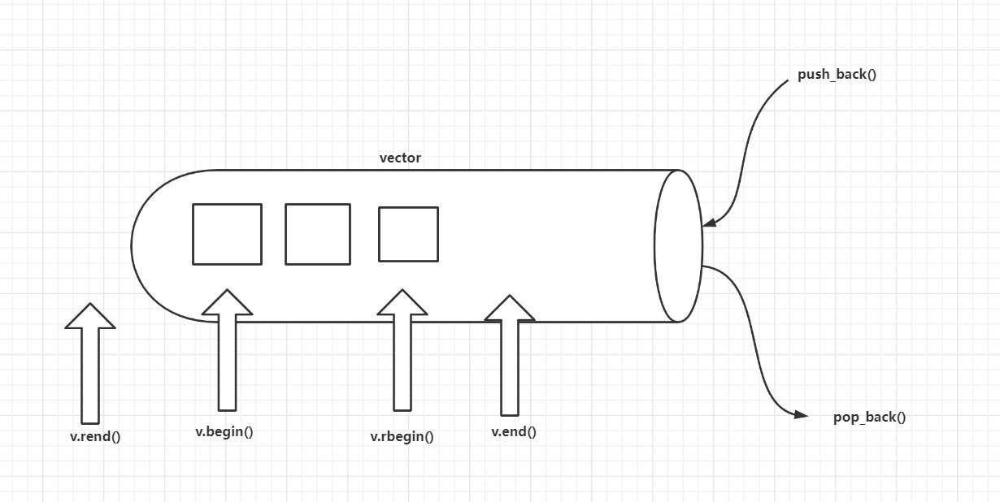

**vector实现动态增长:**

**当插入新元素的时候，如果空间不足，那么vector会重新申请更大的一块内存空间(默认两倍,容量的概念)，将原空间数据拷贝到新空间(地址也会变化)，释放旧空间的数据，再把新元素插入新申请空间。**


###3.1.2 基本函数

**1.构造函数**

- vector():创建一个空vector
- vector(int nSize):创建一个vector,元素个数为nSize
- vector(int nSize,const t& t):创建一个vector，元素个数为nSize,且值均为t
- vector(const vector&):复制构造函数
- vector(begin,end):复制[begin,end)区间内另一个数组的元素到vector中

**2.增加函数**

- void push_back(const T& x):向量尾部增加一个元素X
- iterator insert(iterator it,const T& x):向量中迭代器指向元素前增加一个元素x
- iterator insert(iterator it,int n,const T& x):向量中迭代器指向元素前增加n个相同的元素x
- iterator insert(iterator it,const_iterator first,const_iterator last):向量中迭代器指向元素前插入另一个相同类型向量的[first,last)间的数据

**3.删除函数**

- iterator erase(iterator it):删除向量中迭代器指向元素
- iterator erase(iterator first,iterator last):删除向量中[first,last)中元素
- void pop_back():删除向量中最后一个元素
- void clear():清空向量中所有元素

**4.遍历函数**

- reference at(int pos):返回pos位置元素的引用
- reference front():返回首元素的引用
- reference back():返回尾元素的引用
- iterator begin():返回向量头指针，指向第一个元素
- iterator end():返回向量尾指针，指向向量最后一个元素的下一个位置
- reverse_iterator rbegin():反向迭代器，指向最后一个元素
- reverse_iterator rend():反向迭代器，指向第一个元素之前的位置

**5.判断函数**

- bool empty() const:判断向量是否为空，若为空，则向量中无元素

**6.大小函数**

- int size() const:返回向量中元素的个数
- int capacity() const:返回当前向量张红所能容纳的最大元素值
- int max_size() const:返回最大可允许的vector元素数量值

**7.其他函数**

- void swap(vector&):交换两个同类型向量的数据
- void assign(int n,const T& x):设置向量中第n个元素的值为x
- void assign(const_iterator first,const_iterator last):向量中[first,last)中元素设置成当前向量元素

**8.函数**

> 1.push_back 在数组的最后添加一个数据
>
> 2.pop_back 去掉数组的最后一个数据
>
> 3.at 得到编号位置的数据
>
> 4.begin 得到数组头的指针
>
> 5.end 得到数组的最后一个单元+1的指针
>
> 6．front 得到数组头的引用
>
> 7.back 得到数组的最后一个单元的引用
>
> 8.max_size 得到vector最大可以是多大
>
> 9.capacity 当前vector分配的大小
>
> 10.size 当前使用数据的大小
>
> 11.resize 改变当前使用数据的大小，如果它比当前使用的大，者填充默认值
>
> 12.reserve 改变当前vecotr所分配空间的大小
>
> 13.erase 删除指针指向的数据项
>
> 14.clear 清空当前的vector
>
> 15.rbegin 将vector反转后的开始指针返回(其实就是原来的end-1)
>
> 16.rend 将vector反转构的结束指针返回(其实就是原来的begin-1)
>
> 17.empty 判断vector是否为空
>
> 18.swap 与另一个vector交换数据

#### 3.1.3  vector 的初始化

```cpp
 (0) vector<int> a;      //创建空vector

 (1) vector<int> a(10);  //定义了10个整型元素的向量, 没有给出初值，其值是不确定的。

（2）vector<int> a(10,1); //定义了10个整型元素的向量, 且给出每个元素的初值为1

（3）vector<int> b(3, 2);
     vector<int> a(b); //用b向量来创建a向量，整体复制性赋值

（4）vector<int> b(3, 2);
    vector<int> a(b.begin(),b.begin+3); //定义了a值为b中第0个到第2个（共3个）元素 [开始下标索引, 下标索引) = [开始下标索引, 一共的元素个数] =  [开始下标索引, 结束下标索引 + 1] 

（5）int b[7]={1,2,3,4,5,9,8};
	vector<int> a(b,b+7);   //从数组中获得值  [下标索引, 下标索引)
	int arr[] = { 1, 2, 3, 4 };
	vector<int> v2(arr, arr + sizeof(arr) / sizeof(int));  // 存入arr中的全部元素
	
	vector<int> nums;
	int a[nums.size];
    memcpy(a, &nums[0], sizeof(a));  // vector转普通数组
    quickSort(a, nums.size());
    memcpy(&nums[0], a, sizeof(a));  // 普通数组转vector

 (6) vector<int> a(3);  // 当成普通数组用:
     a[0] = 6;          // vector只有声明了个数后, 才能更普通数组一样进行a[0],a[1]的操作
     a[1] = 4;
     a[2] = 1;

 (7) vector<int> n = {1,2,3,4,2,2,2,5,5,3,2,2,2,7,2};

 (8)vector<int> b(3, 2);
	vector<int> a;
	a = b;      // 重载=
```

**注意: 公式 =  [开始下标索引, 下标索引) = [开始下标索引,  加上开始的元素一共的元素个数] =  [开始下标索引, 结束下标索引 + 1]**  = [开始下标索引,  第几个结束的元素]


#### 3.1.4 vector对象的重要操作

举例说明如下：

##### 3.1.4.1**常用的赋值操作  **

+ 默认构造

  ```c++
  (1). int arr[] = {1, 2, 3, 4};
       vector<int> v1(arr, arr + sizeof(arr)/sizeof(int));
  
  (2). vector<int> b(4, 2);
       vector<int> a(b.begin(),b.begin+3);   // [下标索引, 下标索引)
    
  (3). vector<int> b(3, 2);
       vector<int> a(b);       //用b向量来创建a向量，整体复制性赋值
  ```

+ 成员方法

  ```c++
  (1). vector<int> b(4, 2); 
       a.assign(b.begin(), b.begin()+3);  // [下标索引, 下标索引)
  
  (2). a.assign(4,2);    //a只含4个元素，且每个元素为2
  
  (3). vector<int> v2;
  	 v2.assign(v1.begin(), v1.end());
  ```

+ 重载

  ```c++
  vector<int> b(3, 2);
  vector<int> a;
  a = b;             // 重载
  ```

+ 交换数据 

  ```c++
  a.swap(b); //b为向量，将a中的元素和b中的元素进行整体性交换
  ```

  **巧用swap收缩vector空间 : **

  思想: 利用小的匿名对象，交换当前大对象，当前大对交换后象变成匿名对象，自动释放了。	vector<int>(v).swap(v);  // 匿名对象

  ```c++
  void test02()
  {
  	//vector添加元素他会自动增长但是删除元素时候，是不会自动减少的
  	vector<int> v;
  
  	for (int i = 0; i < 100000; i++) {
  		v.push_back(i);
  	}
  	cout << "size:" << v.size() << endl;          // size:100000
  	cout << "capacity:" << v.capacity() << endl; //capacity: 138255
  
  	v.resize(10);
  	cout << "size:" << v.size() << endl;          // size:10
  	cout << "capacity:" << v.capacity() << endl;  //capacity:138255
  
  	// 收缩空间
  	vector<int>(v).swap(v);  // 匿名对象
  	cout << "size:" << v.size() << endl;          // size:10
  	cout << "capacity:" << v.capacity() << endl;  //capacity : 10
  }
  ```

  

##### 3.1.4.2**常用的大小操作  **

+ 成员方法

  ```c++
  a.size():       // 返回容器中元素的个数
  ```

  ```c++
  a.empty();      // 判断a是否为空，空则返回ture,不空则返回false
  ```

  ```c++
  a.capacity() :  // 返回a在内存中总共可以容纳的元素个数(容器的容量) 容量>=大小 
  ```

  ```c++
  resize(int num);      //重新指定容器的长度为num，若容器变长，则以默认值0填充新位置。如果容器变短，则末尾超出容器长度的元素被删除。
  resize(int num,elem); //重新指定容器的长度为num，若容器变长，则以elem值填充新位置。如果容器变短，则末尾超出容器长度的元素被删除。
  
  //例子:
  a.resize(10);    //将a的现有元素个数调至10个，多则删，少则补，其值随机
  a.resize(10, 2);  //将a的现有元素个数调至10个，多则删，少则补，其值为2
  ```

  ```c++
  a.reserve(int len):  //容器预留len个元素长度，预留位置不初始化，元素不可访问。
  a.reserve(100); 
  //将a的容量（capacity）扩充至100，也就是说现在测试a.capacity();的时候返回值是100.
  //这种操作只有在需要给a添加大量数据的时候才显得有意义，因为这将避免内存多次容量扩充操作（当a的容量不足时电脑会自动扩容，当然这必然降低性能） 
  ```

  + reserv 和 resize的区别

   reserve  只是开辟内存空间.  是容器预留空间，但在空间内不真正创建元素对象，所以在没有添加新的对
  象之前，不能引用容器内的元素.  可以使用 push_back()
  resize    是改变容器的大小，且在创建对象，因此，调用这个函数之后，就可以引用容
  器内的对象了.

  + 巧用reserve增加程序效率:

  **如果大概知道有多少数据，就直接使用reserve()指定预留空间，能够减少vector扩容时数据拷贝带来的开销。**

  ```c++
  void test03()
  {
  	int num = 0;
  	int* addr = NULL;
  
  	vector<int> v;
  	for (int i = 0; i < 10000; i++)
      {
        //在往v中添加元素时，它在空间不足时会换入一个新的空间，这个时候v的地址就改变了，那个num计数一次
  		v.push_back(i);
  		if (addr != &v[0])
  		{
  			addr = &v[0];
  			num++;
  		}
  	}
      
  	cout << "num" << num << endl;     // 24
  }
  ```

  

##### 3.1.4.3**常用的数据存取操作 **

+ 成员方法

  ```c++
  at(int idx): //返回索引 idx所指的数据，如果idx越界，抛出 out_of _range异常。
  a.at(i)      //返回a的第i个元素
  ```

  ```c++
  a.front(); //返回a的第一个元素  //类比begin()是返回第一个 迭代器
  a.back();  //返回a的最后一个元素
  ```

+ 重载

  ```c++
  operator[]; //返回索引 idx所指的数据，越界时，运行直接报错
  a[i];       //返回a的第i个元素
  ```

  

##### 3.1.4.4**常用的插入和删除操作 **

+ 成员方法

  ```c++
  a.push_back(5);  //在a的最后一个向量后插入一个元素，其值为5
  a.pop_back();    //删除a向量的最后一个元素 // 无返回值的
  ```

  ```c++
  insert(const tterator pos，int count,ele);//迭代器指向位置pos插入count个元素
  
  插入位置 个数(可选) 值
  a.insert(a.begin()+1,5);   //在a的第2个元素的位置插入数值5，如a为1,2,3,4，插入元素后为1,5,2,3,4
  a.insert(a.begin()+1,3,5); //在a的第2个元素的位置插入3个数，其值都为5
  
  插入位置 值范围
  a.insert(a.begin()+1,b+3,b+6); //b为数组，在a的第2个元素（从第0个算起）的位置插入b的第4个元素到第6个元素（不包括b+6），如b为1,2,3,4,5,9,8 ，插入元素后为1,4,5,9,2,3,4,5,9,8
  ```

  ```c++
  iterator erase(iterator it)                     //删除向量中迭代器指向元素
  iterator erase(iterator first,iterator last)    //删除向量中范围[first,last)中元素
  
  删除的范围/位置
  a.erase(a.begin()+1,a.begin()+3); //删除a中第2个到第3个元素，也就是说删除的元素从索引1 到 索引 2
  
  例子：
  #include <iostream>
  #include <vector>
  using namespace std;
  ①只删除一个元素
  int main()
  {
      std::vector<int> v = {1, 2, 3, 4, 5, 6};
      v.erase(v.begin()+2);          //删除第三个位置的元素(后面的是索引号)
      for(int i = 0;i<v.size();i++)
        cout<<v[i]<<" ";
      //---------------
      vector<int> num;
      for(vector<int>::iterator iter=num.begin(); iter!=num.end(); iter++)
      {        //从vector中删除指定的某一个元素 
          if(*iter==k)
          {
              num.erase(iter);
              break;
          }
      }
  }
  
  ②删除指定的多个重复元素
  erase函数的返回的是指向被删除元素的下一个元素的迭代器，所以执行erase（）后要把迭代器减1，指向前面一个，执行循环+1的时候就可以恢复到正常位置了
  for (vector<int>::iterator iter = num.begin(); iter != num.end();iter++) 
  {
          if (*iter == k){
              iter = num.erase(iter);
              iter--;              //erase函数的返回指向当前被删除元素的下一个元素的迭代器
      }
  }
  ```
  
  ```c++
  a.clear(); //清空a中的元素
  ```
  
  ~~~c++
  //clear()清除容器中所有数据**
  #include <string.h>
  #include <vector>
  #include <iostream>
  using namespace std;
   
  int main()
  {
      vector<int>obj;
      for(int i=0;i<10;i++)//push_back(elem)在数组最后添加数据 
      {
          obj.push_back(i);
          cout<<obj[i]<<",";
      }
   
      obj.clear();//清除容器中所以数据
      for(int i=0;i<obj.size();i++)
      {
          cout<<obj[i]<<endl;
      }
   
      return 0;
  }
  ```
  
  //输出结果为：
  0,1,2,3,4,5,6,7,8,9,
  
  ~~~
  

##### 3.1.4.5 查找

find(a.begin(),a.end(),10); //在a中的从a.begin()（包括它）到a.end()（不包括它）的元素中查找10，若存在返回其在向量中的位置, 返回值是const_iterator类型!!没找到返回 end()

```c++
vector<int>::iterator it = find(vec.begin(),vec.end(),1);    // 和一般的不同这要用这个接收
if(it != vec.end())
	cout<<"found"<<endl;
else
	cout<<"not found"<<endl;
```

小于或等于num最大值的位置，可以用upper_bound() - 1来确定，另外需要注意判断下标为-1的情况
大于或等于num最小值的位置，可以用lower_bound()来确定，另外需要注意判断下标为n的情况

```c++
int pos1 = upper_bound(vec.begin(), vec.end(), query) - vec.begin() - 1;   // 大于等于的索引
// 通过返回的地址减去起始地址begin,得到找到数字在数组中的下标。
int min = (pos1 == -1) ? -1 : vec[pos1]; 
int pos2 = lower_bound(vec.begin(), vec.end(), query) - vec.begin();      // 小于等于的索引
int max = (pos2 == vec.size()) ? -1 : vec[pos2];
res.push_back({min, max});
```


#### 3.1.4.5 总结

vector是个动态数组，当空间不足的时候插入新元素，vector会重新申请一块更大的
内存空间，将旧空间数据拷贝到新空间，然后释放旧空间。vector是单口容器，所以在尾
端插入和删除元素效率较高，在指定位置插入，势必会引起数据元素移动，效率较低。

```c++
  
	（1）a.assign(b.begin(), b.begin()+3); //b为向量，将b的0~2个元素构成的向量赋给a
    （2）a.assign(4,2); //是a只含4个元素，且每个元素为2
    （3）a.back(); //返回a的最后一个元素
    （4）a.front(); //返回a的第一个元素
    （5）a[i]; //返回a的第i个元素，当且仅当a[i]存在2013-12-07
    （6）a.clear(); //清空a中的元素
    （7）a.empty(); //判断a是否为空，空则返回ture,不空则返回false
    （8）a.pop_back(); //删除a向量的最后一个元素

--------------------------------------------------
    （9）a.erase(a.begin()+1,a.begin()+3); //删除a中第1个（从第0个算起）到第2个元素，也就是说删除的元素从a.begin()+1算起（包括它）一直到a.begin()+ 3（不包括它） //有点像for()

    （10）a.push_back(5); //在a的最后一个向量后插入一个元素，其值为5
    
    （11）a.insert(a.begin()+1,5); //在a的第1个元素（从第0个算起）的位置插入数值5，如a为1,2,3,4，插入元素后为1,5,2,3,4
    （12）a.insert(a.begin()+1,3,5); //在a的第1个元素（从第0个算起）的位置插入3个数，其值都为5
    （13）a.insert(a.begin()+1,b+3,b+6); //b为数组，在a的第1个元素（从第0个算起）的位置插入b的第3个元素到第5个元素（不包括b+6），如b为1,2,3,4,5,9,8     ，插入元素后为1,4,5,9,2,3,4,5,9,8
         a.insert(b+3,b+6);  
    
    （14）a.size(); //返回a中元素的个数；
    （15）a.capacity(); //返回a在内存中总共可以容纳的元素个数
    （16）a.resize(10);    //将a的现有元素个数调至10个，多则删，少则补，其值随机
    （17）a.resize(10,2);  //将a的现有元素个数调至10个，多则删，少则补，其值为2
    
    （18）a.reserve(100); //将a的容量（capacity）扩充至100，也就是说现在测试a.capacity();的时候返回值是100.这种操作只有在需要给a添加大量数据的时候才         显得有意义，因为这将避免内存多次容量扩充操作（当a的容量不足时电脑会自动扩容，当然这必然降低性能） 
    （19）a.swap(b);   //b为向量，将a中的元素和b中的元素进行整体性交换
    （20）a==b;        //b为向量，向量的比较操作还有!=,>=,<=,>,<
```


```
    min(a, b) // 功能是一个最小值的函数，比较两个数值的大小，返回他们的之间最小值.
    如:    #include <algorithm>
            int a=2;
            int b=3;
            min(a,b);


三、顺序访问vector的几种方式，举例说明如下：
（1）向 向量a中添加元素

1、也可以从数组中选择元素向向量中添加

int a[6]= {1,2,3,4,5,6};
vector<int> b；
for(int i=1;i<=4;i++)
	b.push_back(a[i]);   // 每次调用就进行  它是追加
 

 

2、也可以从现有向量中选择元素向向量中添加

int a[6]={1,2,3,4,5,6};
vector<int> b;
vector<int> c(a,a+4);
for(vector<int>::iterator it=c.begin();it<c.end();it++)
	b.push_back(*it);


4、也可以从文件中读取元素向向量中添加

ifstream in("data.txt");
vector<int> a;
for(int i; in>>i)
    a.push_back(i);
 
（2）从向量中读取元素
    
1、通过下标方式读取

int a[6]={1,2,3,4,5,6};
vector<int> b(a,a+4);
for(int i=0;i<=b.size()-1;i++)
    cout<<b[i]<<" ";

2、通过遍历器方式读取

int a[6]={1,2,3,4,5,6};
vector<int> b(a,a+4);
for(vector<int>::iterator it=b.begin();it!=b.end();it++)
    cout<<*it<<" ";
 


//vector的三种遍历方式 
方式一 ： 数组下标

#include<iostream>
#include<cstdio>
#include<algorithm>
#include<vector>
using namespace std;
int main(void)
{
	vector<int> ve;
	for(int i=0;i<5;i++) 
        ve.push_back(i);
	for(int i=0;i<5;i++) 
        cout<<ve[i]<<" ";
}

方式二 ： 迭代器

#include<iostream>
#include<cstdio>
#include<algorithm>
#include<vector>
using namespace std;
int main(void)
{
	vector<int> ve;
	for(int i=0;i<5;i++) 
        ve.push_back(i);
	for(vector<int>::iterator it=ve.begin();it!=ve.end();it++) 
        cout<<*it<<" ";
}

方式三 : auto

#include<iostream>
#include<cstdio>
#include<algorithm>
#include<vector>
using namespace std;
int main(void)
{
	vector<int> ve;
	for(int i=0;i<5;i++) 
        ve.push_back(i);
	for(auto it=ve.begin();it!=ve.end();it++) 
        cout<<*it<<" ";
}

#include<iostream>
#include<cstdio>
#include<algorithm>
#include<vector>
using namespace std;
int main(void)
{
	vector<int> ve;
	for(int i=0;i<5;i++) 
        ve.push_back(i);
	for(auto x : ve)    // 
        cout<<x<<" ";
}


四、几种重要的算法，使用时需要包含头文件：

#include<algorithm>
//需要包含 头文件并不是内置的方法
    
-------------------------------------------    
 （1）sort(a.begin(),a.end()); // 对a中的从a.begin()（包括它）到a.end()（不包括它）的元素进行 //
    						  // 从小到大排列
      sort(nums.rbegin(), nums.rend());    // 从大到小

//对 vector string 用 sort排序
sort()根据字母排列字典顺序 -------相同在排下一个位置
    
// 自定义的要求排序  从大到小排
static bool cmp(const vector<int> a, const vector<int> b)
{
    if (a[0] == b[0]) return a[1] < b[1];  //  如果第一个位置相等就比较第二个位置
    return a[0] > b[0];  // 这里改一下还能按绝对值大小排abs(a) > abs(b)
}
sort (people.begin(), people.end(), cmp);   //
    
    
string s1[3]={"alower","flow","flws"};
string s2[3]={"flower","flow","flowe"};
vector<string> str1(s1,s1+3),str2(s2,s2+3);

sort(str1.begin(),str1.end());
sort(str2.begin(),str2.end());

for ( vector<string>::iterator it = str1.begin();  it != str1.end(); ++it ) 
       cout << *it<< ' '; 
cout<<endl;
for ( vector<string>::iterator it = str2.begin();  it != str2.end(); ++it ) 
       cout << *it<< ' '; 

结果：
alower flow flws
flow flowe flower
————————————————


---------------------------------------------


（2）reverse(a.begin(),a.end()); //对a中的从a.begin()（包括它）到a.end()（不包括它）的元素倒置，但不排列，如a中元素为1,3,2,4,倒置后为4,2,3,1
（3）copy(a.begin(),a.end(),b.begin()+1); //把a中的从a.begin()（包括它）到a.end()（不包括它）的元素复制到b中，从b.begin()+1的位置（包括它）开始复制，覆盖掉原有元素
 -----------------------
（4）find(a.begin(),a.end(),10); //在a中的从a.begin()（包括它）到a.end()（不包括它）的元素中查找10，若存在返回其在向量中的位置, 返回值是const_iterator类型!!

vector<int>::iterator it = find(vec.begin(),vec.end(),1);    // 和一般的不同这要用这个接收
if(it != vec.end())
	cout<<"found"<<endl;
else
	cout<<"not found"<<endl;
```


#### 3.1.5 简单介绍

1. Vector<类型>标识符

2. Vector<类型>标识符(最大容量)

3. Vector<类型>标识符(最大容量,初始所有值)

4. Int i[5]={1,2,3,4,5} 
   Vector<类型>vi(I,i+2);//得到i索引值为3以后的值
   
5. Vector< vector< int> >v; 二维向量//这里最外的<>要有空格。否则在比较旧的编译器下无法通过

   

#### 3.1.6 案例

**简单实现**

```c++
#include <iostream>

using namespace std;

template <class T> class MyVecctor
{
protected:
	// 容量
	int mCapacity;
	// 保存数据首地址
	T* pAddr;

	// 迭代器
public:
	T* begin()
	{
		return pAddr;
	}
	T* end()
	{
		return pAddr + mCurSize;
	}

	class iterator
	{
	public:
		iterator(T* p = nullptr) : pMove(p) {}
		/*iterator& operator=(const iterator& rhs) const noexcept
		{
			return this->pMove = rhs.pMove;
		}*/

		iterator& operator=(T* pMove)
		{
			this->pMove = pMove;
			return *this;
		}
		bool operator!=(T* pMove)
		{
			return this->pMove != pMove;
		}
		iterator& operator++(int)
		{
			this->pMove++;
			return (*this);
		}
		T operator*()
		{
			return *pMove;
		}

	private:
		T* pMove;
	};

public:
	// 当前个数
	int mCurSize;    // 也方便写迭代器

	MyVecctor(int capacity)
	{
		mCapacity = capacity;
		mCurSize = 0;
		// 申请内存
		pAddr = new T[mCapacity];   // new一个数组
	}

	~MyVecctor()
	{
		if (pAddr != NULL)
			delete[] pAddr;
	}

	//复制构造函数
	MyVecctor(const MyVecctor<T>& arr)
	{
		mCapacity = arr.mCapacity;
		mCurSize = arr.mCurSize;

		pAddr = new T[mCapacity];
		for (int i = 0; i < mCapacity; i++)
		{
			pAddr[i] = arr.pAddr[i];
		}
	}

	//赋值运算符重载
	MyVecctor<T>& operator=(const MyVecctor<T>& arr)
	{
		if (this == arr)
			return *this;

		// 释放原来的内存
		if (pAddr)
			delete[] pAddr;

		mCapacity = arr.mCapacity;
		mCurSize = arr.mCurSize;

		pAddr = new T[mCapacity];
		for (int i = 0; i < mCapacity; i++)
		{
			pAddr[i] = arr.pAddr[i];
		}
	}

	T& operator[](int index)
	{
		return pAddr[index];
	}

	void PushBack(T& data)
	{
		if (mCurSize >= mCapacity)
			return;

		//调用拷贝构造 和 =号操作符
		//1. 对象元素 必须能够被拷贝
		//2．容器都是值语义, 而非引用语义,向容器中放入元素，都放入元素的拷贝
		//3. 如果元素的成员有指针，注意深拷贝和浅拷贝问题
		pAddr[mCurSize] = data;
		mCurSize++;
	}

	//解决右值问题  myVecctor.PushBack(100)
	void PushBack(T&& data)
	{
		if (mCurSize >= mCapacity)
			return;
		pAddr[mCurSize] = data;
		mCurSize++;
	}

};


int main(void)
{
	MyVecctor<int> myVecctor(20);
	int a = 10, b = 20, c = 30, d = 40;
	myVecctor.PushBack(a);
	myVecctor.PushBack(b);
	myVecctor.PushBack(c);
	myVecctor.PushBack(d);

	for (int i = 0; i < myVecctor.mCurSize; i++)
	{
		cout << myVecctor[i] << endl;
	}

	//PushBack(T &data) // myVecctor.PushBack(100);  //err
	// 左值和右值的问题  //左引用只能接受左值  // 100是右值
	// 解决 PushBack(T &&data)

	MyVecctor<int>::iterator it;
	// 使用迭代器
	for (it = myVecctor.begin(); it != myVecctor.end(); it++)
	{
		cout << *it;
	}
	cout << endl;

	// 下面的方式需要  iterator(T* p = nullptr) : pMove(p) {}
	for (MyVecctor<int>::iterator it2 = myVecctor.begin(); it2 != myVecctor.end(); it2++)
	{
		cout << *it2;
	}


	return 0;
}

```


#### **二维数组两种定义方法（结果一样）**

**方法一**

```cpp
#include <string.h>
#include <vector>
#include <iostream>
#include <algorithm>
using namespace std;
 
 
int main()
{
    int N=5, M=6; 
    vector<vector<int> > obj(N);        //定义二维动态数组大小5行 
    for(int i =0; i< obj.size(); i++)   //动态二维数组为5行6列，值全为0 
    { 
        obj[i].resize(M); 
    } 
 
    for(int i=0; i< obj.size(); i++)//输出二维动态数组 
    {
        for(int j=0;j<obj[i].size();j++)
        {
            cout<<obj[i][j]<<" ";
        }
        cout<<"\n";
    }
    return 0;
}
```

**方法二(推荐)**

**vector<vector<int> > A( m, vector<int>(n)  );  得到的图像:**

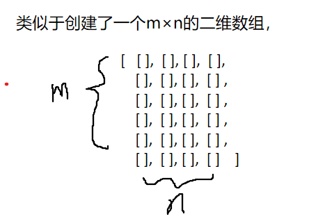

长度

```cpp
//vector<vector<int> >A中的vector元素的个数
len = A.size();     // 行的个数
//vector<vector<int> > A中第i个vector元素的长度
len = A[i].size();   // 某一列的个数
```

```cpp
#include <string.h>
#include <vector>
#include <iostream>
#include <algorithm>
using namespace std;
 
 
int main()
{
    int M=5, N=6; 
    vector<vector<int> > obj(M, vector<int>(N)); //定义二维动态数组5行6列 的全0数组
 
    for(int i=0; i< obj.size(); i++)//输出二维动态数组 
    {
        for(int j=0;j<obj[i].size();j++)
        {
            cout<<obj[i][j]<<" ";
        }
        cout<<"\n";
    }
    return 0;
}
```

输出结果为：

```html
0 0 0 0 0 0 
0 0 0 0 0 0 
0 0 0 0 0 0 
0 0 0 0 0 0 
0 0 0 0 0 0 
```

## 3.2 deque

#### 3.2.1 deque 容器概念

**基本特性:**

+ 双端插入和删除元素效率较高.
+ 指定位置插入也会导致数据元素移动,  降低效率.
+ 可随机存取,效率高.

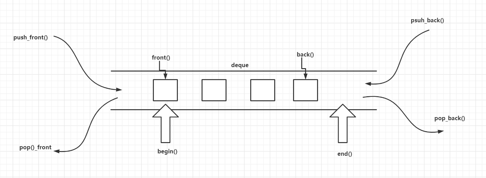

所谓的deque*/*dek*/*是”double ended queue”的缩写，**双端队列不论在尾部或头部插入元素，都十分迅速**。而在中间插入元素则会比较费时，因为必须移动中间其他的元素。双端队列是一种随机访问的数据类型，提供了在序列两端快速插入和删除操作的功能，它可以在需要的时候改变自身大小，完成了标准的C++数据结构中队列的所有功能。 

**Vector VS deque :**

1. Vector是单向开口的连续线性空间，deque则是一种双向开口的连续线性空间。

2. deque对象在队列的两端放置元素和删除元素是高效的，而向量vector只是在插入序列的末尾时操作才是高效的。

3. **deque和vector的最大差异**，一在于deque允许于常数时间内对头端进行元素的插入或移除操作，二在于deque没有所谓的capacity观念，因为它是动态地以分段连续空间组合而成，随时可以增加一段新的空间并链接起来。换句话说，像vector那样“因旧空间不足而重新配置一块更大空间，然后复制元素，再释放旧空间”这样的事情在deque中是不会发生的。也因此，deque没有必要提供所谓的空间预留（reserved）功能。 

   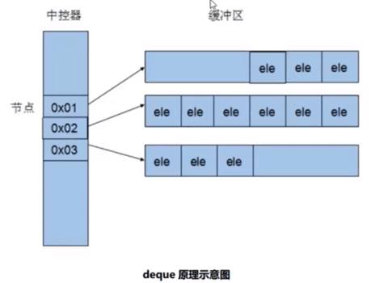

虽然deque也提供Random Access Iterator，但它的迭代器并不是普通指针，其复杂度和vector不可同日而语，这当然涉及到各个运算层面。因此，**除非必要，我们应尽可能选择使用vector而非deque。**

对deque进行的排序操作，为了最高效率，可将deque先完整复制到一个vector身上，将vector排序后（利用STL的sort算法），再复制回deque。 

deque是一种优化了的对序列两端元素进行添加和删除操作的基本序列容器。通常由一些独立的区块组成，第一区块朝某方向扩展，最后一个区块朝另一方向扩展。它允许较为快速地随机访问但它不像vector一样把所有对象保存在一个连续的内存块，而是多个连续的内存块。并且在一个映射结构中保存对这些块以及顺序的跟踪。


#### 3.2.2 基本函数

1. deq[ ]：用来访问双向队列中单个的元素。
2. deq.front()：返回第一个元素的引用。
3. deq.back()：返回最后一个元素的引用。
4. deq.push_front(x)：把元素x插入到双向队列的头部。
5. deq.pop_front()：弹出双向队列的第一个元素。
6. deq.push_back(x)：把元素x插入到双向队列的尾部。
7. deq.pop_back()：弹出双向队列的最后一个元素。


#### 3.2.3 deque 的初始化

基本和vector使用方式一样

```c++
#include<deque>  // 头文件
deque<T> deqT;   // 默认构造形式
deque(beg，end): // 构造函数将[beg， end)区间中的元素拷贝给本身。
deque(n,elem);   //构造函数将n个 elem拷贝给本身。
deque(const deque &deq):  // 拷贝构造函数。
```

```cpp
deque<type> deq;  // 声明一个元素类型为type的双端队列que
deque<type> deq(size);  // 声明一个类型为type、含有size个默认值初始化元素的的双端队列que
deque<type> deq(size, value);  // 声明一个元素类型为type、含有size个value元素的双端队列que
deque<type> deq(mydeque);  // deq是mydeque的一个副本
deque<type> deq(first, last);  // 使用迭代器first、last范围内的元素初始化deq
```


#### 3.2.4 deque对象的重要操作

举例说明如下：

##### 3.2.4.1**常用的赋值操作  **

+ 默认构造

+ 成员方法

  ```c++
  assign(beg， end);  //将[beg，end)区间中的数据拷贝赋值给本身。
  assign(n, elem);    //将n个elem拷贝赋值给本身。
  ```

+ 重载

  ```c++
  deque& operator=(const deque &deq);   
  ```

+ 交换数据 

  ```c++
  a.swap(b); //b为向量，将a中的元素和b中的元素进行整体性交换
  ```

  

##### 3.2.4.2  常用的大小操作

+ 成员方法

  ```c++
  deque.size();   //返回容器中元素的个数
  ```

  ```c++
  deque.empty (); //判断容器是否为空
  ```

  ```c++
  resize(num);      //重新指定容器的长度为num,若容器变长，则以默认值填充新位置。如果容器变短，则末尾超出容器长度的元素被删除。
  resize(num,elem); //重新指定容器的长度为num,若容器变长，则以elem值填充新位置,如果容器变短，则末尾超出容器长度的元素被删除。
  
  //例子:
  deque.resize(10);    //将a的现有元素个数调至10个，多则删，少则补，其值随机
  deque.resize(10, 2);  //将a的现有元素个数调至10个，多则删，少则补，其值为2
  ```

  

##### 3.2.4.3   常用的数据存取

+ 成员方法

  ```c++
  at(idx);       //返回索引 idx所指的数据，如果idx越界，抛出 out_of _range异常。
  ```

  ```c++
  deque.front(); //返回a的第一个元素  //类比begin()是返回第一个迭代器
  deque.back();  //返回a的最后一个元素 
  ```

+ 重载

  ```c++
  operator[]://返回索引idx所指的数据，如果idx越界，不抛出异常,直接出错。
  ```

  

##### 3.2.4.4 常用的插入和删除操作

+ 成员方法

  ```c++
  push_back(elem);   // 在容器尾部添加一个数据
  pop_back():        // 删除容器最后一个数据  // 无返回值的
  
  push_front(elem);  // 在容器头部插入一个数据
  pop_front();       // 删除容器第一个数据   // 无返回值的
  
  .....
  ```
  
  


#### 3.2.3 简单介绍

1. deque支持随机访问，即支持[ ]以及at()，但是性能没有vector好。

2. 支持随机访问，即支持[ ]以及at()，但是性能没有vector好。

3. 可以在内部进行插入和删除操作，但性能不及list。

4. deque两端都能够快速插入和删除元素，而vector只能在尾端进行。

5. deque的元素存取和迭代器操作会稍微慢一些，因为deque的内部结构会多一个间接过程。

6. deque迭代器是特殊的智能指针，而不是一般指针，它需要在不同的区块之间跳转。

7. deque可以包含更多的元素，其max_size可能更大，因为不止使用一块内存。

8. deque不支持对容量和内存分配时机的控制。

9. 在除了首尾两端的其他地方插入和删除元素，都将会导致指向deque元素的任何pointers、references、iterators失效。不过，deque的内存重分配优于vector，因为其内部结构显示不需要复制所有元素。

10. deque的内存区块不再被使用时，会被释放，deque的内存大小是可缩减的。不过，是不是这么做以及怎么做由实际操作版本定义。

11. deque不提供容量操作：capacity()和reverse()，但是vector可以。

    

#### 3.2.4 案例

```cpp
#include <iostream>
#include <string>
#include <vector>
#include <deque>
#include <algorithm>

using namespace std;

// 评委打分案例(sort算法排序)
// 创建5个选手(姓名，得分)，10个评委对5个选手进行打分
// 得分规则:去除最高分, 去除最低分, 取出平均分
// 按得分对5名选手进行排名

class Player {
public:
	string mName;
	int mScore;

public:
	Player() {};
	Player(string name, int score) : mName(name), mScore(score) {}
};

// 创建选手
void creatPlayer(vector<Player>& v)
{
	Player p;
	string nameSeed = "ABCDE";
	for (int i = 0; i < 5; i++)
	{
		p.mName = "选手";
		p.mName += nameSeed[i];
		p.mScore = 0;
		v.push_back(p);
	}
}

// 打分
void setScore(vector<Player>& v)
{
	for (vector<Player>::iterator it = v.begin(); it != v.end(); it++)
	{
		// 当前同学打分
		deque<int> de;
		for (int j = 0; j < 10; j++)
		{
			int score = rand() % 41 + 60;
			de.push_back(score);
		}

		// 对分数排序
		sort(de.begin(), de.end());

		// 去除最低分和最高分
		de.pop_back();
		de.pop_front();

		// 求平均分
		int sum = 0;
		for (deque<int>::iterator dit = de.begin(); dit != de.end(); dit++)
		{
			sum += *dit;
		}
		int deuce = static_cast<double>(sum) / 10;
		(*it).mScore = deuce;
	}
}

static bool cmp(const Player& v1, const Player& v2)
{
	return v1.mScore > v2.mScore;
}

// 根据分数排名
void printRank(vector<Player>& v)
{
	// 排序
	sort(v.begin(), v.end(), cmp);
	for (vector<Player>::iterator it = v.begin(); it != v.end(); it++)
	{
		cout << "姓名:" << (*it).mName << "得分:" << (*it).mScore << endl;
	}
}

int main(void)
{
	// 定义vector容器,保存选手信息
	vector<Player> vPlayer;
	creatPlayer(vPlayer);
	setScore(vPlayer);
	printRank(vPlayer);
	return 0;
}
```

输出结果：

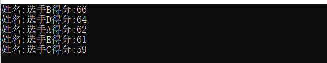


## 3.3 list

#### 3.3.1 list 容器概念

**基本特性:**

+ List是stl实现的双向链表，与向量(vectors)相比, 它允许快速的插入和删除，但是随机访问却比较慢。

+ 链表是由一系列的结点组成，结点包含两个域，一个数据域，一个指针域。
+ 链表内存是非连续的，添加删除元素时间复杂度都是常数项，不需要移动元素，比数组添加删除效率高。
+ 链表只有在需要的时候，才分配内存。
+ 链表只要你拿到第一个结点相当于拿到整个链表。
+ 链表需要额外的空间保存结点关系前驱后继关系

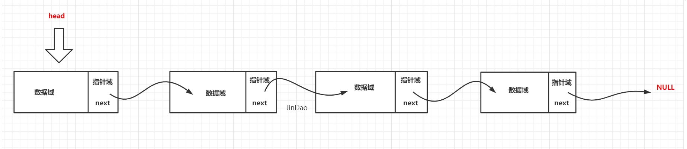

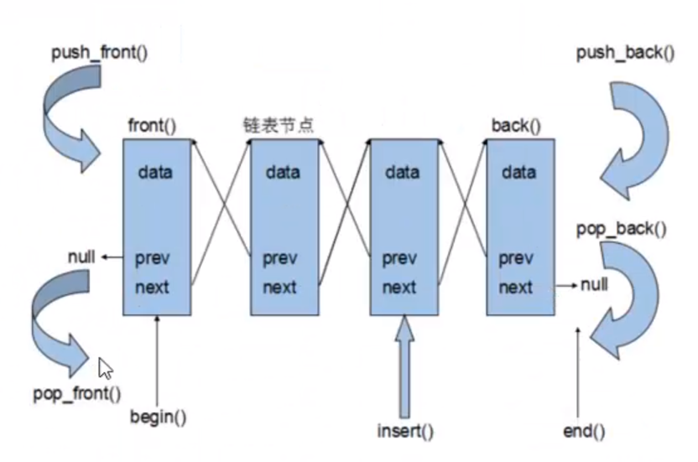


#### 3.3.2  基本函数

1. Lst1.assign() 给list赋值 
2. Lst1.back() 返回最后一个元素 
3. Lst1.begin() 返回指向第一个元素的迭代器 
4. Lst1.clear() 删除所有元素 
5. Lst1.empty() 如果list是空的则返回true 
6. Lst1.end() 返回末尾的迭代器 
7. Lst1.erase() 删除一个元素 
8. Lst1.front() 返回第一个元素 
9. Lst1.get_allocator() 返回list的配置器 
10. Lst1.insert() 插入一个元素到list中 
11. Lst1.max_size() 返回list能容纳的最大元素数量 
12. Lst1.merge() 合并两个list 
13. Lst1.pop_back() 删除最后一个元素 
14. Lst1.pop_front() 删除第一个元素 
15. Lst1.push_back() 在list的末尾添加一个元素 
16. Lst1.push_front() 在list的头部添加一个元素 
17. Lst1.rbegin() 返回指向第一个元素的逆向迭代器 
18. Lst1.remove() 从list删除元素 
19. Lst1.remove_if() 按指定条件删除元素 
20. Lst1.rend() 指向list末尾的逆向迭代器 
21. Lst1.resize() 改变list的大小 
22. Lst1.reverse() 把list的元素倒转 
23. Lst1.size() 返回list中的元素个数 
24. Lst1.sort() 给list排序 
25. Lst1.splice() 合并两个list 
26. Lst1.swap() 交换两个list 
27. Lst1.unique() 删除list中相邻重复的元素


#### 3.3.3 list 的初始化

基本和vector使用方式一样

```c++
list<int>lst1;        //创建空list
list<int> lst2(5);    //创建含有5个元素的list
list<int>lst3(3,2);   // 创建含有3个元素的list
list<int>lst4(lst2);  //使用lst2初始化lst4
list<int>lst5(lst2.begin(),lst2.end()); //同lst4
```


#### 3.3.4 list对象的重要操作

##### 3.3.4.1**常用的赋值操作  **

+ 默认构造

  ```c++
  list<T> 1stT;    //list采用采用模板类实现,对象的默认构造形式:
  list (beg, end); //构造函数将[beg，end)区间中的元素拷贝给本身。
  list(n,elem);    //构造函数将n个elem拷贝给本身。
  list(const list &lst):  //拷贝构造函数。
  ```

+ 成员方法

  ```c++
  assign(beg， end);  //将[beg，end)区间中的数据拷贝赋值给本身。
  assign(n, elem);    //将n个elem拷贝赋值给本身。
  ```

+ 重载

  ```c++
  deque& operator=(const deque &deq);   
  ```

+ 交换数据 

  ```c++
  a.swap(b); //b为向量，将a中的元素和b中的元素进行整体性交换
  ```

  

##### 3.3.4.2 常用的大小操作

+ 成员方法

  ```c++
  size();        //返回容器中元素的个数
  empty();       //判断容器是否为空
  resize(num);   //重新指定容器的长度为num,若容器变长，则以默认值填充新位置。
  ```


##### 3.2.4.3   常用的数据存取

+ 成员方法

  ```c++
  list.front(); //返回a的第一个元素  //类比begin()是返回第一个迭代器
  list.back();  //返回a的最后一个元素 
  ```

  

##### 3.3.4.4 常用的插入和删除操作

+ 成员方法

  ```c++
  push_back(elem);    //在容器尾部加入一个元素
  pop_back();         //删除容器中最后一个元素
  
  push_front(elem):   //在容器开头插入一个元素
  pop_front();        //从容器开头移除第一个元素
  ```

  ```c++
  // 插入位置 个数(可选) 值
  insert(pos,elem):        //在 pos位置插elem元素的拷贝，返回新数据的位置。
  insert(pos, n, elem);//在.pos位置插入n个elem数据，无返回值。
  
  // 插入位置 值范围
  insert (pos, beg,end);   //在 poE位置插入[beg, end)区间的数据，无返回值。clear(;//移除容器的所有数据
  ```

  ```c++
  erase(beg, end);    //删除[beg,end)区间的数据，返回下一个数据的位置。
  erase(pos);         //删除pos位置的数据，返回下一个数据的位置。
  ```

  ```c++
  remove(elem);     //删除容器中所有与elem值匹配的元素。(特有)
  ```


##### 3.3.4.5 list 的反转和排序操作

+ 成员方法

  ```c++
  reverse();    //反转链表，比如lst包含1,3,5元素，运行此方法后，lst就包贫5,3,1元素。
  ```

  ```c++
  sort();      //list排序  // 默认从小到大
  
  // sort实现从大到小
  static bool cmp(int l1, int l2)
  {
      return l1 > l2;
  }
  list<int> li;
  li.sort(cmp);
  ```

  注意:  该reverse 和 sort();   只是list中的一个成员函数并不是stl算法中提供的sort() 和 reverse();  原因 : list不支持随机访问，所以算法的sort不适用于list。


#### 3.3.5 简单介绍


#### 3.3.6 案例

**3.3.4.1 迭代器遍历list**

```cpp
for(list<int>::const_iterator iter = lst1.begin();iter != lst1.end();iter++)
{
    cout<<*iter;
}
cout<<endl;

或者 for (auto l : list)
```

**简单实现**

这个例子有问题的

```c++
#include <iostream>

using namespace std;

template <typename T>
struct Node
{
	T data;
	Node<T>* next;
	Node(T data) : data(data), next(nullptr) {}
};

template <class T>
class MyList
{
public:
	MyList()
	{
		frontNode = nullptr;
	}
	T front()
	{
		return frontNode->data;
	}
	T back()
	{
		return backNode->data;
	}
	int size()
	{
		return curSize;
	}
	bool empty()
	{
		return curSize == 0;
	}
	void push_front(T data)
	{
		Node<T>* newNode = new Node<T>(data);  // 创建一个新节点
		newNode->next = frontNode;  // 指向原来的头部 
		if (curSize == 0)
		{
			backNode = newNode;
		}
		frontNode = newNode;
		curSize++;
	}

	void push_bak(T data)
	{
		Node<T>* newNode = new Node<T>(data);  // 创建一个新节点
		backNode->next = newNode;  // 指向原来的头部 
		if (curSize == 0)
		{
			frontNode = newNode;
		}
		backNode = newNode;
		curSize++;
	}

public:

	class iterator
	{
	public:
		iterator(Node<T>* pMove) : pMove(pMove) {}
		iterator() = default;
		iterator operator++()
		{
			this->pMove = this->pMove->next;
			return (*this);
		}
		bool operator!=(iterator object)
		{
			return this->pMove != object.pMove;
		}
		T operator*()
		{
			return this->pMove->data;
		}
	private:
		Node<T>* pMove;
	};

	iterator begin()
	{
		return iterator(frontNode);
	}

	iterator end()
	{
		return iterator(backNode);
	}

protected:
	Node<T>* frontNode;
	Node<T>* backNode;
	int curSize;
};


int main(void)
{
	MyList<int> mylit;
	for (int i = 0; i < 3; i++)
	{
		//mylit.push_front(i);   // 2 1 0
		mylit.push_bak(i);
	}


	MyList<int>::iterator myit = mylit.begin();
	while (myit != mylit.end())
	{
		cout << *myit << endl;
		++myit;
	}

	for (auto l : mylit)
	{
		cout << l << endl;
	}
	return 0;
}
```


**自定义类型排序**

```c++
#include <iostream>
#include <list>
#include <string>

using namespace std;

//list操作自定义类型
class MM
{
public:
	MM(string name, int age) : name(name), age(age) {}
	~MM() {}
	string getName()
	{
		return name;
	}

	int getAgge()
	{
		return age;
	}

protected:
	string name;
	int age;
};


// 自己写排序规则  参数是比较的数
static bool cmp(MM& l1, MM& l2)
{
	return l1.getName() > l2.getName();
}


int main(void)
{
	list<MM> mm;

	for (int i = 0; i < 3; i++)
	{
		string str = "data" + to_string(i);
		mm.push_back(MM(str, 19 - i));
	}

	//for (auto l : mm)
	//{
	//	cout << l.getAgge();
	//}

	// 排序
	mm.sort(cmp);   // 类属性有好几个,不知道怎么排序 // 解决使用 自己写排序规则

	for (auto l : mm)
	{
		cout << l.getName() << endl;
	}
	return 0;
}
```

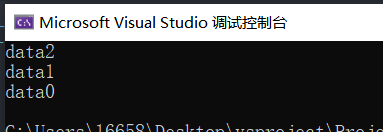

**3.3.4.2 综合实例1**

```cpp
#include <iostream>
#include <list>
#include <numeric>
#include <algorithm>
using namespace std;
 
typedef list<int> LISTINT;
typedef list<int> LISTCHAR;
 
void main()
{
	//用LISTINT创建一个list对象
	LISTINT listOne;
	//声明i为迭代器
	LISTINT::iterator i;
 
	listOne.push_front(3);
	listOne.push_front(2);
	listOne.push_front(1);
 
	listOne.push_back(4);
	listOne.push_back(5);
	listOne.push_back(6);
 
	cout << "listOne.begin()--- listOne.end():" << endl;
	for (i = listOne.begin(); i != listOne.end(); ++i)
		cout << *i << " ";
	cout << endl;
 
	LISTINT::reverse_iterator ir;
	cout << "listOne.rbegin()---listOne.rend():" << endl;
	for (ir = listOne.rbegin(); ir != listOne.rend(); ir++) {
		cout << *ir << " ";
	}
	cout << endl;
 
	int result = accumulate(listOne.begin(), listOne.end(), 0);
	cout << "Sum=" << result << endl;
	cout << "------------------" << endl;
 
	//用LISTCHAR创建一个list对象
	LISTCHAR listTwo;
	//声明i为迭代器
	LISTCHAR::iterator j;
 
	listTwo.push_front('C');
	listTwo.push_front('B');
	listTwo.push_front('A');
 
	listTwo.push_back('D');
	listTwo.push_back('E');
	listTwo.push_back('F');
 
	cout << "listTwo.begin()---listTwo.end():" << endl;
	for (j = listTwo.begin(); j != listTwo.end(); ++j)
		cout << char(*j) << " ";
	cout << endl;
 
	j = max_element(listTwo.begin(), listTwo.end());
	cout << "The maximum element in listTwo is: " << char(*j) << endl;
	system("pause");
}
```

输出结果

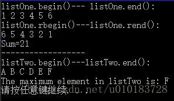

**3.3.4.3 综合实例2** 

```cpp
#include <iostream> 
#include <list> 
 
using namespace std;
typedef list<int> INTLIST;
 
//从前向后显示list队列的全部元素 
void put_list(INTLIST list, char *name)
{
	INTLIST::iterator plist;
 
	cout << "The contents of " << name << " : ";
	for (plist = list.begin(); plist != list.end(); plist++)
		cout << *plist << " ";
	cout << endl;
}
 
//测试list容器的功能 
void main(void)
{
	//list1对象初始为空 
	INTLIST list1;
	INTLIST list2(5, 1);
	INTLIST list3(list2.begin(), --list2.end());
 
	//声明一个名为i的双向迭代器 
	INTLIST::iterator i;
 
	put_list(list1, "list1");
	put_list(list2, "list2");
	put_list(list3, "list3");
 
	list1.push_back(7);
	list1.push_back(8);
	cout << "list1.push_back(7) and list1.push_back(8):" << endl;
	put_list(list1, "list1");
 
	list1.push_front(6);
	list1.push_front(5);
	cout << "list1.push_front(6) and list1.push_front(5):" << endl;
	put_list(list1, "list1");
 
	list1.insert(++list1.begin(), 3, 9);
	cout << "list1.insert(list1.begin()+1,3,9):" << endl;
	put_list(list1, "list1");
 
	//测试引用类函数 
	cout << "list1.front()=" << list1.front() << endl;
	cout << "list1.back()=" << list1.back() << endl;
 
	list1.pop_front();
	list1.pop_back();
	cout << "list1.pop_front() and list1.pop_back():" << endl;
	put_list(list1, "list1");
 
	list1.erase(++list1.begin());
	cout << "list1.erase(++list1.begin()):" << endl;
	put_list(list1, "list1");
 
	list2.assign(8, 1);
	cout << "list2.assign(8,1):" << endl;
	put_list(list2, "list2");
 
	cout << "list1.max_size(): " << list1.max_size() << endl;
	cout << "list1.size(): " << list1.size() << endl;
	cout << "list1.empty(): " << list1.empty() << endl;
 
	put_list(list1, "list1");
	put_list(list3, "list3");
	cout << "list1>list3: " << (list1 > list3) << endl;
	cout << "list1<list3: " << (list1 < list3) << endl;
 
	list1.sort();
	put_list(list1, "list1");
 
	list1.splice(++list1.begin(), list3);
	put_list(list1, "list1");
	put_list(list3, "list3");
	system("pause");
}
```

输出结果：

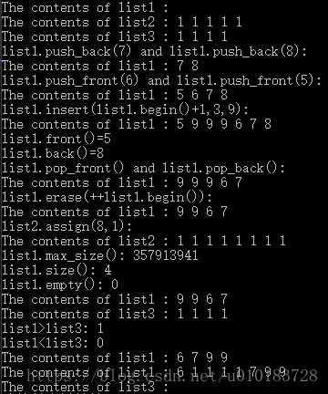

```c++
#include <string>
#include <list>
#include <iostream>
using namespace std;

int main()
{

    list<string> lstStr;
    lstStr.push_front("33333");
    lstStr.push_front("1111");
    lstStr.push_back("0000");
 
    // 1111 33333 0000 

    list<string>::iterator iter=lstStr.begin();
    advance(iter,3-1);//取其中第三个元素
    string ddds=*iter;
    cout << ddds << endl;
    lstStr.erase(iter);

    for (auto s : lstStr)
    {
        cout << s << " ";
    }


    cout << endl;
    string str=lstStr.front();

    cout << str;
    return 0;
}
```

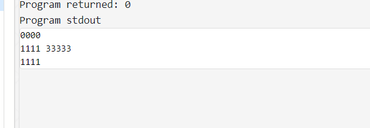


##  3.4 map/multimap

#### 3.4.1   map/multimap容器概念

**基本特性:**

+ map和multimap都需要#include<map>，唯一的不同是，map的键值 key不可重复，而multimap可以，也正是由于这种区别，map支持[ ]运算符，multimap不支持[ ]运算符。在用法上没什么区别。
+ map相对于set区别，map具有键值和实值，所有元素根据**==键值==自动排序**。pair的第
  一元素被称为键值,第二元素被称为实值。
+ map的迭代器不可以修改map的键值, 键值关系到容器内元素的排列规则，任意改变键值会破坏容器的排列规
  则，但是可以改变实值。
+ map内部所有的数据都是有序的 . 储存是按字母 顺序排序的

C++中map提供的是一种键值对容器，里面的数据都是成对出现的,如下图：每一对中的第一个值称之为关键字(key)，每个关键字只能在map中出现一次；第二个称之为该关键字的对应值。

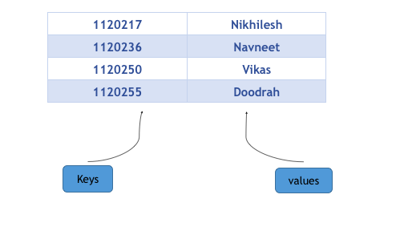


#### 3.4.2 基本操作函数

   **begin**()     返回指向map头部的迭代器

   **clear**(）    删除所有元素

   **count**()     返回指定元素出现的次数

   **empty**()     如果map为空则返回true

   **end**()      返回指向map末尾的迭代器

   **equal_range**()  返回特殊条目的迭代器对

   **erase**()     删除一个元素

   **find**()     查找一个元素

   **get_allocator**() 返回map的配置器

   **insert**()    插入元素

   **key_comp**()   返回比较元素key的函数

   **lower_bound**()  返回键值>=给定元素的第一个位置

   **max_size**()   返回可以容纳的最大元素个数

   **rbegin**()    返回一个指向map尾部的逆向迭代器

   **rend**()     返回一个指向map头部的逆向迭代器

   **size**()     返回map中元素的个数

   **swap**()      交换两个map

   **upper_bound**()  返回键值>给定元素的第一个位置

   **value_comp**()   返回比较元素value的函数


#### 3.4.3  map 的初始化

```cpp
map<int, string> ID_Name;
 
map<int, string> ID_Name = 
{
                { 2015, "Jim" },
                { 2016, "Tom" },
                { 2017, "Bob" }
};  // 和二维数组,结构体数组的初始化差不多
```


#### 3.4.4   map对象的重要操作

#### 3.4.4.1**常用的赋值操作  **

+ 交换

  ```c++
  // 两个map的内容互换
  void swap( map& other );
  ```


#### 3.4.4.2  常用的大小操作

+ 成员方法

  ```c++
  // 查询map是否为空
  bool empty();
   
  // 查询map中键值对的数量
  size_t size();
   
  // 查询map所能包含的最大键值对数量，和系统和应用库有关。
  // 此外，这并不意味着用户一定可以存这么多，很可能还没达到就已经开辟内存失败了
  size_t max_size();
   
  // 查询关键字为key的元素的个数，在map里结果非0即1
  size_t count( const Key& key ) const; //
  ```

  

####  3.4.4.3   常用的数据存取

+ 成员方法

  ```c++
  first()     // 键
  second()    // 值
  ```

+ 重载

  ```c++
  operator[]:   //返回索key所指的value,
  ```

  

#### 3.4.4.4  常用的插入和删除操作

+ 插入

**3.4.4.4.1   用insert插入pair数据**

```cpp
int main(void)
{
	map<int, string> mapStudent;  
    mapStudent.insert(pair<int, string>(2, "student_one"));  
    mapStudent.insert(pair<int, string>(1, "student_two"));
     mapStudent.insert(pair<int, string>(7, "499"));

    //返回插入位置以及是否插入成功
    std::pair<std::map<int, string>::iterator, bool> ret;
    ret = mapStudent.insert(std::pair<int, string>(7, "499"));
    if (ret.second == false)
    {
        std::cout << "元素7已经存在了";
        std::cout << " 7的值是" << ret.first->second << '\n';
    }

    map<int, string>::iterator iter;   
    for(iter = mapStudent.begin(); iter != mapStudent.end(); iter++)  
        cout<<iter->first<<' '<<iter->second<<endl;  
	return 0;
}

// 结果:
元素7已经存在了 7的值是499
1 student_two
2 student_one
7 499
```

**3.4.4.4.2  用insert函数插入value_type数据** 

```cpp
map<int, string> mapStudent;    
mapStudent.insert(map<int, string>::value_type (1, "student_one"));    
mapStudent.insert(map<int, string>::value_type (2, "student_two"));    

map<int, string>::iterator iter;    
for(iter = mapStudent.begin(); iter != mapStudent.end(); iter++)  
    cout<<iter->first<<' '<<iter->second<<endl;    

// 结果:
1 student_two
2 student_one
```

**3.4.4.4.3 用insert函数进行多个插入** 

insert共有4个重载函数：

```cpp
// 插入单个键值对，并返回插入位置和成功标志，插入位置已经存在值时，插入失败
pair<iterator,bool> insert (const value_type& val);
 //在指定位置插入，在不同位置插入效率是不一样的，因为涉及到重排
iterator insert (const_iterator position, const value_type& val);
 // 插入多个
void insert (InputIterator first, InputIterator last);
 //c++11开始支持，使用列表插入多个   
void insert (initializer_list<value_type> il);
```

下面是具体使用示例：

```cpp
std::map<char, int> mymap;

//指定位置插入
std::map<char, int>::iterator it = mymap.begin();
mymap.insert(it, std::pair<char, int>('b', 300));  //效率更高
mymap.insert(it, std::pair<char, int>('c', 400));  //效率非最高

//范围多值插入
std::map<char, int> anothermap;
anothermap.insert(mymap.begin(), mymap.find('c'));

// 列表形式插入
anothermap.insert({ { 'd', 100 }, {'e', 200} });

```

**3.4.4.4.4 用数组方式插入数据** 

key不存在就插入, key存在就修改对应的实值

```cpp
map<int, string> mapStudent;    
mapStudent[1] = "student_one";   
mapStudent[2] = "student_two";    

map<int, string>::iterator iter;    
for(iter = mapStudent.begin(); iter != mapStudent.end(); iter++)    
    cout<<iter->first<<' '<<iter->second<<endl;    

// 结果:
1 student_two
2 student_one
```

以上三种用法，虽然都可以实现数据的插入，但是它们是有区别的，当然了第一种和第二种在效果上是完成一样的，用insert函数插入数据，在数据的 插入上涉及到集合的唯一性这个概念，即当map中有这个关键字时，insert操作是插入数据不了的，但是用数组方式就不同了，它可以覆盖以前该关键字对 应的值，用程序说明

mapStudent.insert(map<int, string>::value_type (1, "student_one"));

mapStudent.insert(map<int, string>::value_type (1, "student_two"));

上面这两条语句执行后，map中1这个关键字对应的值是“student_one”，第二条语句并没有生效，那么这就涉及到我们怎么知道insert语句是否插入成功的问题了，可以用pair来获得是否插入成功，程序如下

pair<map<int, string>::iterator, bool> Insert_Pair;

Insert_Pair = mapStudent.insert(map<int, string>::value_type (1, "student_one"));

我们通过pair的第二个变量来知道是否插入成功，它的第一个变量返回的是一个map的迭代器，如果插入成功的话Insert_Pair.second应该是true的，否则为false。

下面给出完成代码，演示插入成功与否问题

```cpp
//验证插入函数的作用效果  
#include <map>    
#include <string>    
#include <iostream>    
using namespace std;  
  
int main()    
{  
    map<int, string> mapStudent;  
    pair<map<int, string>::iterator, bool> Insert_Pair;    
    Insert_Pair = mapStudent.insert(pair<int, string>(1, "student_one"));    
    if(Insert_Pair.second == true)  
        cout<<"Insert Successfully"<<endl;    
    else    
        cout<<"Insert Failure"<<endl;    
    Insert_Pair = mapStudent.insert(pair<int, string>(1, "student_two"));    
    if(Insert_Pair.second == true)    
        cout<<"Insert Successfully"<<endl;    
    else    
        cout<<"Insert Failure"<<endl;    
    map<int, string>::iterator iter;   
    for(iter = mapStudent.begin(); iter != mapStudent.end(); iter++)    
       cout<<iter->first<<' '<<iter->second<<endl;    
}  
```

 大家可以用如下程序，看下用数组插入在数据覆盖上的效果

```cpp
//验证数组形式插入数据的效果   
#include <map>    
#include <string>    
#include <iostream>    
using namespace std;  
  
int main()    
{    
    map<int, string> mapStudent;    
    mapStudent[1] = "student_one";    
    mapStudent[1] = "student_two";    
    mapStudent[2] = "student_three";    
    map<int, string>::iterator iter;    
    for(iter = mapStudent.begin(); iter != mapStudent.end(); iter++)    
       cout<<iter->first<<' '<<iter->second<<endl;  
}  
```

+  **删除**

```cpp
// 删除迭代器指向位置的键值对，并返回一个指向下一元素的迭代器
iterator erase( iterator pos )
 // 删除一定范围内的元素，并返回一个指向下一元素的迭代器
iterator erase( const_iterator first, const_iterator last );
 // 根据Key来进行删除， 返回删除的元素数量，在map里结果非0即1
size_t erase( const key_type& key );
```

```c++
// 清空map，清空后的size为0
void clear();
```


#### 3.4.4.5  map 查找操作

+ 成员方法

  ```c++
  // 关键字查询，找到则返回指向该关键字的迭代器，否则返回指向end的迭代器
  // 根据map的类型，返回的迭代器为 iterator 或者 const_iterator
  iterator find (const key_type& k);
  const_iterator find (const key_type& k) const;
  ```

     ```c++
     lower_bound(keyElem);  //返回第一个key>=keyElem元素的迭代器。
     upper_bound(keyElem);  //返回第一个key>keyElem元素的迭代器。
     equal_range(keyElem);  //返回该容器中key 与 keyElem相等的上下限的两个迭代器。
     
     // set s1中有 1 2 4 5 7
     map<int, int> mymap;
     mymap.insert(pair<int, int>(1, 4));
     mymap.insert(pair<int, int>(2, 5));
     mymap.insert(pair<int, int>(4, 4));
     //equal_range返回Lower_bound 和upper_bound的迭代器
     pair<map<int, int>::iterator, map<int, int>::iterator> ret = mymap.equal_range(2); 
     if (ret.first->secondsecond)
     {
        // 返回Lower_bound的值  1 
     }
     if (ret.second->second)
     {
          //返回upper_bound值   4
     }
     ```
  
  ```c++
  count(key)       //返回值是一个整数，1表示有这个元素，0表示没有这个元素。
  ```
  
  

#### 3.4.5   unordered_map

头文件: ==include <unordered_map>==

unordered_map 底层实现哈希表

+ 常用于有顺序要求的问题。如果需要对map中的数据排序，就首选map，它会把数据按照key的自然排序排序（由于它的底层实现红黑树机制所以会排序），
+ 常用于单纯查找问题。如果不需要排序，一般都会选择unordered_map，它的查找效率会更高。


#### 3.4.6  map 更改默认排序

STL中所有排序问题默认是采用小于号来排序的。

+ 常见类型(如int 型)，它本身支持小于号运算。
+ 一些特殊情况，比如是一个结构体或者自定义类，涉及到排序就会出现问题，因为它没有小于号操作，insert等函数在编译的时候过不去，下面给出两个方法解决这个问题。

默认: 从小到大

**3.4.7.1 小于号 < 重载**

```cpp
#include <iostream>  
#include <string>  
#include <map>  
using namespace std;
 
typedef struct tagStudentinfo
{
	int    niD;
	string strName;
	bool operator < (tagStudentinfo const& _A) const
	{     //这个函数指定排序策略，按niD排序，如果niD相等的话，按strName排序  
		if (niD < _A.niD) return true;
		if (niD == _A.niD)
			return strName.compare(_A.strName) < 0;
		return false;
	}
}Studentinfo, *PStudentinfo; //学生信息  
 
int main()
{
	int nSize;   //用学生信息映射分数  
	map<Studentinfo, int>mapStudent;
	map<Studentinfo, int>::iterator iter;
    
    // 结构体对象初始化
	Studentinfo studentinfo;
	studentinfo.niD = 1;
	studentinfo.strName = "student_one";
    // 插入
	mapStudent.insert(pair<Studentinfo, int>(studentinfo, 90));  // 在map中插入结构体对象和int
	
    
    // 结构体对象初始化
    studentinfo.niD = 2;
	studentinfo.strName = "student_two";
    // 插入
	mapStudent.insert(pair<Studentinfo, int>(studentinfo, 80));
    
    // each
	for (iter = mapStudent.begin(); iter != mapStudent.end(); iter++)
		cout << iter->first.niD << ' ' << iter->first.strName << ' ' << iter->second << endl;
	return 0;
}
```

**3.4.7.2 仿函数的应用，这个时候结构体中没有直接的小于号重载** (推荐)

```cpp
 #include <iostream>  
#include <map>  
#include <string>  
using namespace std;
 
typedef struct tagStudentinfo
{
	int      niD;
	string   strName;
}Studentinfo, *PStudentinfo; //学生信息  
 
// 仿函数
class sort
{
public:
	bool operator() (Studentinfo const &_A, Studentinfo const &_B) const
	{
		if (_A.niD < _B.niD)
			return true;
		if (_A.niD == _B.niD)
			return _A.strName.compare(_B.strName) < 0;
		return false;
	}
};
 

int main()
{   
	//用学生信息映射分数  
	map<Studentinfo, int, sort>mapStudent;   // sort
	map<Studentinfo, int>::iterator iter;
    
	Studentinfo studentinfo;
	studentinfo.niD = 1;
	studentinfo.strName = "student_one";
	mapStudent.insert(pair<Studentinfo, int>(studentinfo, 90));
    
	studentinfo.niD = 2;
	studentinfo.strName = "student_two";
	mapStudent.insert(pair<Studentinfo, int>(studentinfo, 80));
    
	for (iter = mapStudent.begin(); iter != mapStudent.end(); iter++)
		cout << iter->first.niD << ' ' << iter->first.strName << ' ' << iter->second << endl;
	system("pause");
}
```


#### 3.4.7 迭代器

共有八个获取迭代器的函数：** begin, end, rbegin,rend** 以及对应的 ** cbegin, cend, crbegin,crend**。

二者的区别在于，后者一定返回 const_iterator，而前者则根据map的类型返回iterator 或者 const_iterator。const情况下，不允许对值进行修改。如下面代码所示：

```cpp
map<int,int>::iterator it;
map<int,int> mmap;
const map<int,int> const_mmap;
 
it = mmap.begin(); //iterator
mmap.cbegin(); //const_iterator
 
const_mmap.begin(); //const_iterator
const_mmap.cbegin(); //const_iterator
```

返回的迭代器可以进行加减操作，此外，如果map为空，则 begin = end。


#### 3.4.6 案例


## 3.5  set/multiset

#### 3.5.1 set/multiset  容器概念

**基本特性:**

+ set/multiset的特性是所有元素会根据元素的值**自动进行排序并且去重**。set与map不同，set中的元素即是键值又是实值
+ multiset特性及用法和set完全相同，唯一的差别在于它允许键值重复。
+ set和multiset的底层实现是一种高效的平衡二叉树，即红黑树（Red-Black Tree)。
+ set 不允许两个元素有相同的键值。
+ 不能通过set的迭代器去修改set元素，原因是修改元素会破坏set组织。当对容器中的元素进行插入或者删除时，操作之前的所有迭代器在操作之后依然有效。
+ 由于set元素是排好序的，且默认为升序，因此当set集合中的元素为结构体或自定义类时，该结构体或自定义类必须实现运算符‘<’的重载。

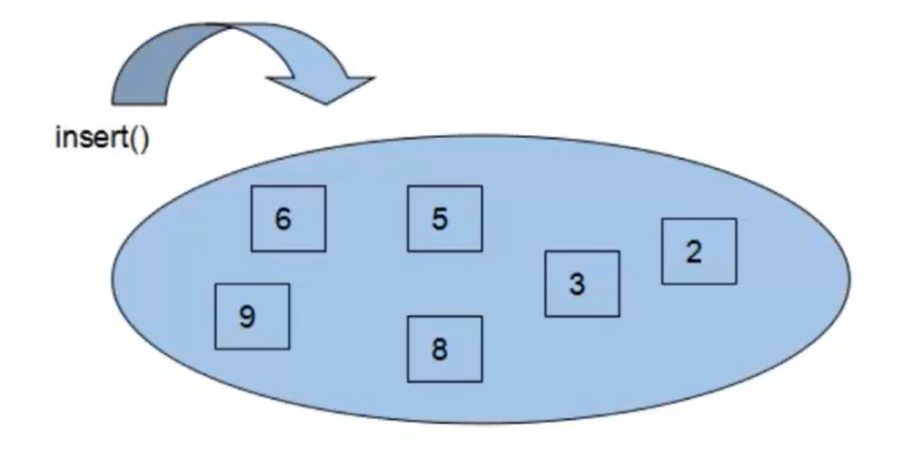

`std::set` 是关联容器，含有 `Key` 类型对象的已排序集。用比较函数compare进行排序。搜索、移除和插入拥有对数复杂度。 set 通常以红黑树实现。


#### 3.5.2 基本函数

1. begin()--返回指向第一个元素的迭代器

2. clear()--清除所有元素

3. count()--返回某个值元素的个数

4. empty()--如果集合为空，返回true

5. end()--返回指向最后一个元素的迭代器

6. equal_range()--返回集合中与给定值相等的上下限的两个迭代器

7. erase()--删除集合中的元素

8. find()--返回一个指向被查找到元素的迭代器

9. get_allocator()--返回集合的分配器

10. insert()--在集合中插入元素

11. lower_bound()--返回指向大于（或等于）某值的第一个元素的迭代器

12. key_comp()--返回一个用于元素间值比较的函数

13. max_size()--返回集合能容纳的元素的最大限值

14. rbegin()--返回指向集合中最后一个元素的反向迭代器

15. rend()--返回指向集合中第一个元素的反向迭代器

16. size()--集合中元素的数目

17. swap()--交换两个集合变量

18. upper_bound()--返回大于某个值元素的迭代器

19. value_comp()--返回一个用于比较元素间的值的函数


#### 3.5.3 set 的初始化

基本和vector使用方式一样

```c++
set<T> st;               //set默认构造函数:
mulitset<T> mst;   //multiset 默认构造函数:
set(const set &st);    //拷贝构造函数
```

```c++
std::set<int> first;                           // empty set of ints

int myints[]= {10,20,30,40,50};
std::set<int> second (myints,myints+5);        // range

std::set<int> third (second);                  // a copy of second

std::set<int> fourth (second.begin(), second.end());  // iterator ctor.
```


#### 3.5.4 set对象的重要操作

#### 3.5.4.1 常用的赋值操作

+ 默认构造

+ 成员方法:   无

+ 重载

  ```c++
  set& operator=(const set &st); //重载等号操作符
  ```

+ 交换数据

  ```c++
  swap(st);//交换两个集合容器
  ```

  

#### 3.5.4.2  常用的大小操作

+ 成员方法

  ```c++
  size();    //返回容器中元素的数目
  empty() ;  //判断容器是否为空
  ```


#### 3.5.4.3   常用的数据存取

+ 成员方法

  ```c++
  first()     // 键
  second()    // 值
  ```

  

#### 3.5.4.4 常用的插入和删除操作

+ 成员方法

  ```c++
  insert(elem);    //在容器中插入元素。
  ```

  注意: 没有 push_back()之类的操作

  ```c++
  erase(pos);         //删除 pos 迭代器所指的元素，返回下一个元素的迭代器。
  erase(beg， end);   //删除区间[beg,end)的所有元素，返回下一个元素的迭代器。
  erake(elem);        //删除容器中值为一个elem的元素。(特有)
  ```

  ```c++
  clear() ;           //清除所有元素
  ```

  

#### 3.5.4.5  set 查找操作

+ 成员方法

  ```c++
  find(key):    //查找键 key是否存在,若存在，返回该键的元素的迭代器: 若不存在，返回map.end()
  ```

  ```c++
  lower_bound(keyElem);  //返回第一个key>=keyElem元素的迭代器。
  upper_bound(keyElem);  //返回第一个key>keyElem元素的迭代器。
  equal_range(keyElem);  //返回该容器中key 与 keyElem相等的上下限的两个迭代器。
  
  // set s1中有 1 2 4 5 7
  set<int>::iterator ret;
  ret = s1.lower_bound(2);  // 2
  ret = s1.upper_bound(4);  // 4
  //equal_range返回Lower_bound 和upper_bound值
  pair<set<int>::iterator, set<int>::iterator> myret = s1.equal_range(2);  // 2 4
  ```

  ```c++
  count(key)       //返回值是一个整数，1表示有这个元素，0表示没有这个元素。
  ```


####  3.5.5  unordered_set

C++ 11中出现了两种新的关联容器:unordered_set和unordered_map，其内部实现与set和map大有不同，set和map内部实现是基于RB-Tree，而unordered_set和unordered_map内部实现是基于哈希表(hashtable)，由于unordered_set和unordered_map内部实现的公共接口大致相同，所以本文以unordered_set为例。

​    unordered_set是基于哈希表，因此要了解unordered_set，就必须了解哈希表的机制。哈希表是根据关键码值而进行直接访问的数据结构，通过相应的哈希函数(也称散列函数)处理关键字得到相应的关键码值，关键码值对应着一个特定位置，用该位置来存取相应的信息，这样就能以较快的速度获取关键字的信息。比如：现有公司员工的个人信息（包括年龄），需要查询某个年龄的员工个数。由于人的年龄范围大约在[0，200]，所以可以开一个200大小的数组，然后通过哈希函数[=key.gif)](http://private.codecogs.com/eqnedit.php?latex=\dpi{100}&space;\fn_jvn&space;f(key)=key)得到key对应的key-value，这样就能完成统计某个年龄的员工个数。而在这个例子中，也存在这样一个问题，两个员工的年龄相同，但其他信息（如：名字、身份证）不同，通过前面说的哈希函数，会发现其都位于数组的相同位置，这里，就涉及到“冲突”。准确来说，冲突是不可避免的，而解决冲突的方法常见的有：开发地址法、再散列法、链地址法(也称拉链法)。而unordered_set内部解决冲突采用的是----链地址法，当用冲突发生时把具有同一关键码的数据组成一个链表。下图展示了链地址法的使用:

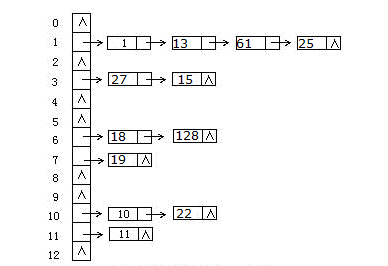

 使用unordered_set需要包含#include<unordered_set>头文件，同unordered_map类似，用法没有什么太大的区别，参考set/multiset。

除此之外unordered_multiset也是一种可选的容器。


1.Map是键值对，Set是值的[集合](https://so.csdn.net/so/search?q=集合&spm=1001.2101.3001.7020)，**当然键和值可以是任何的值**；

2.Map可以通过get方法获取值，而set不能因为它只有值；

4.**Set的值是唯一的可以做数组去重**，Map由于没有格式限制，可以做数据存储

**集合内没有重复元素 ，**

**操作**

hash.size()元素个数

hash.empty()

hash.max_size()获取最大容量值

**迭代器操作**

unordered_set<int>::iterator it;

`unordered_set<int>::iterator ite_begin=c1.begin();`//返回头迭代器

`unordered_set<int>::iterator ite_end=c1.end();` //返回尾部迭代器

 **基本操作**

find（）通过给定的主键查找元素 unordered*set<int>::iterator find*iterator = hash.find(1);

count()返回匹配给定主键元素的个数 hash.count(1);

insert()插入函数 hash.insert(1);

erase()删除 hash.erase(1);

clear()清空 hash.clear();

swap()交换 hash.swap(hash2);


**内存操作**

hash.rehash(10)//设置槽位数

hash.reserve(1000)//改变容器的容量


####  3.5.6 set更改默认排序

以下涉及内容:

1、set容器中，元素类型为基本类型，如何让set按照用户意愿来排序？

2、set容器中，如何让元素类型为自定义类型？

3、set容器的insert函数的返回值为什么类型？

```c++
#include <iostream>
#include <string>
#include <set>
using namespace std;
 
/* 仿函数CompareSet，在test02使用 */
class CompareSet
{
public:
    //从大到小排序
    bool operator()(int v1, int v2)
    {
        return v1 > v2;
    }
    //从小到大排序
    //bool operator()(int v1, int v2)
    //{
    //    return v1 < v2;
    //}
};
 
/* Person类，用于test03 */
class Person
{
    friend ostream &operator<<(ostream &out, const Person &person);
public:
    Person(string name, int age)
    {
        mName = name;
        mAge = age;
    }
    
    friend ostream &operator<<(ostream &out, const Person &person)
	{
    	out << "name:" << person.mName << " age:" << person.mAge << endl;
    	return out;
	}
public:
    string mName;
    int mAge;
};
 

 
/* 仿函数ComparePerson,用于test03 */
class ComparePerson
{
public:
    //名字大的在前面，如果名字相同，年龄大的排前面
    bool operator()(const Person &p1, const Person &p2)
    {
        if (p1.mName == p2.mName)
        {
            return p1.mAge > p2.mAge;
        }
        return p1.mName > p2.mName;
    }
};
 
/* 打印set类型的函数模板 */
template<typename T>
void PrintSet(T &s)
{
    for (T::iterator iter = s.begin(); iter != s.end(); ++iter)
        cout << *iter << " ";
    cout << endl;
}
 
void test01()
{
    //set容器默认从小到大排序
    set<int> s;
    s.insert(10);
    s.insert(20);
    s.insert(30);
 
    //输出set
    PrintSet(s);
    //结果为:10 20 30
 
    /* set的insert函数返回值为一个对组(pair)。
       对组的第一个值first为set类型的迭代器：
       1、若插入成功，迭代器指向该元素。
       2、若插入失败，迭代器指向之前已经存在的元素
       对组的第二个值seconde为bool类型：
       1、若插入成功，bool值为true
       2、若插入失败，bool值为false
    */
    pair<set<int>::iterator, bool> ret = s.insert(40);
    if (true == ret.second)
        cout << *ret.first << " 插入成功" << endl;
    else
        cout << *ret.first << " 插入失败" << endl;
}
 
void test02()
{
    /* 如果想让set容器从大到小排序，需要给set容
       器提供一个仿函数,本例的仿函数为CompareSet
    */
    set<int, CompareSet> s;
    s.insert(10);
    s.insert(20);
    s.insert(30);
    
    //打印set
    PrintSet(s);
    //结果为:30,20,10
}
 
void test03()
{
    /* set元素类型为Person，当set元素类型为自定义类型的时候
       必须给set提供一个仿函数，用于比较自定义类型的大小，
       否则无法通过编译 
    */
    set<Person,ComparePerson> s;
    s.insert(Person("John", 22));
    s.insert(Person("Peter", 25));
    s.insert(Person("Marry", 18));
    s.insert(Person("Peter", 36));
 
    //打印set
    PrintSet(s);
}
 
int main(void)
{
    //test01();
    //test02();
    //test03();
    return 0;
}
```

- multiset容器的insert函数返回值为什么？ 

  ```c++
  #include <iostream>
  #include <set>
  using namespace std;
   
  /* 打印set类型的函数模板 */
  template<typename T>
  void PrintSet(T &s)
  {
      for (T::iterator iter = s.begin(); iter != s.end(); ++iter)
          cout << *iter << " ";
      cout << endl;
  }
   
  void test(void)
  {
      multiset<int> s;
      s.insert(10);
      s.insert(20);
      s.insert(30);
      
      //打印multiset
      PrintSet(s);
   
      /* multiset的insert函数返回值为multiset类型的迭代器，
         指向新插入的元素。multiset允许插入相同的值，因此
         插入一定成功，因此不需要返回bool类型。
      */
      multiset<int>::iterator iter = s.insert(10);
      
      cout << *iter << endl;    
  }
   
  int main(void)
  {
      test();
      return 0;
  }
  ```

  

## 3.6  stack

#### 3.6.1 stack 容器概念

**基本特性:**

+ 先进后出  FLIO(个人理解就近原则)
+ 不提供迭代器–不能遍历, 不支持随机存取
+ 栈不能遍历,不支持随机存取，只能通过top从栈顶获取和删除元素.

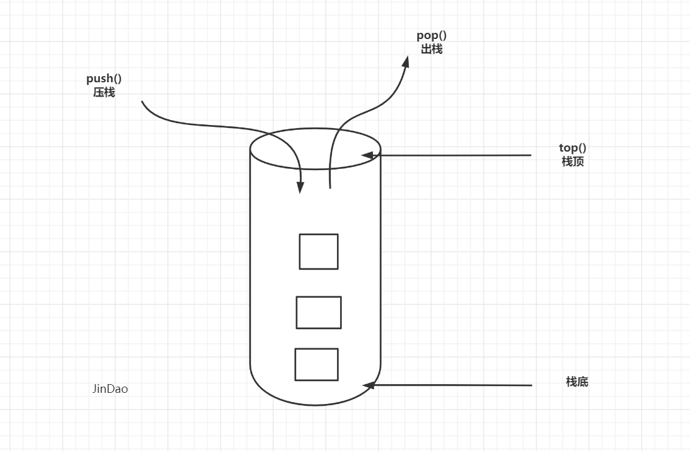


#### 3.6.2 基本函数

- size()
- empty()
- push() 向栈顶插入一个元素
- top() 返回栈顶元素
- pop() 弹出栈顶元素

```c++
赋值操作
stack<T> stk;             //stack采用模板类实现，stack对象的默认构造形式:
stack(const stack &stk);  //拷贝构造函数
```

```c++
赋值操作
stack& operator=(const stack &stk);  //重载等号操作符
```


#### 3.6.3 案例

+ 入门

  ```c++
  stack<int> stk1;
  stack<int> stk2(stk1);
  
  stk1.push(10);
  stk1.push(20);
  stk1.push(40);
  stk1.push(40);
  cout << "栈顶元素: " << stk1.top() << endl;   // 40
  stk1.pop();
  
  while (!stk1.empty())
  {
      cout <<  stk1.top() << "";
      stk1.pop();
  }
  
  cout << stk1.size();   // 0
  ```

  

+ stack容器存放对象指针

  ```
  
  ```

  

+ stack容器存放对象

  ```
  
  ```


+ 简单实现

  ```c++
  #include <iostream>
  #include <vector>
  using namespace std;
  
  
  //数组栈(这里使用中间容器去实现)
  template <class T>
  class MyStack
  {
  public:
  	MyStack() {}
  	void push(T data)
  	{
  		mem.push_back(data);
  	}
  	T top()
  	{
  		return mem[mem.size() - 1];   // vector是先进先出的  
  	}
  	void pop()
  	{
  		mem.erase(mem.end() - 1);
  	}
  	int size()
  	{
  		return mem.size();
  	}
  	bool empty()
  	{
  		return mem.size() == 0;
  	}
  
  protected:
  	vector<T> mem;
  };
  
  
  
  
  int main(void)
  {
  	MyStack<int> myDaya;
  	for (int i = 0; i < 3; i++)
  	{
  		myDaya.push(i);   // 0 1 2
  	}
  
  	while (!myDaya.empty())
  	{
  		cout << myDaya.top();
  		myDaya.pop();
  	}
  	return 0;
  }
  ```

  

## 3.7  queue

#### 3.7.1 queue 容器概念

**基本特性:**

+ 先进先出，类似于排队（不能插队),

+ 不提供迭代器–不能遍历, 不支持随机存取
+ 一端插入另一端删除

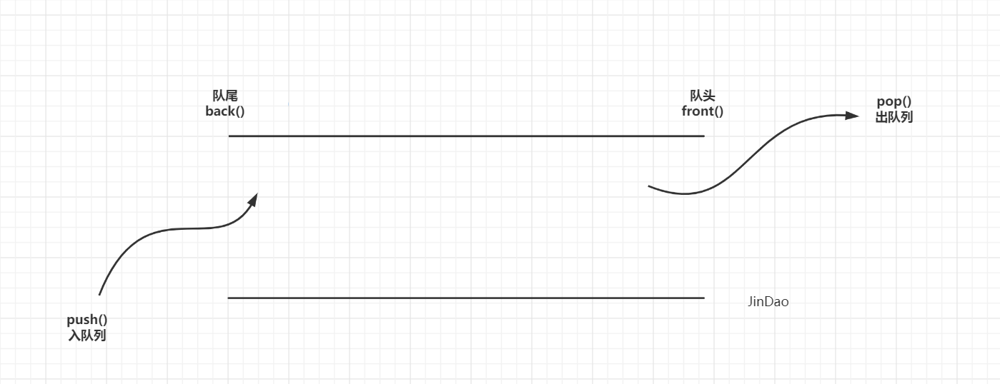


#### 3.7.2 基本函数

- size():判断大小
- empty():判断是否为空
- push():放入一个元素
- front() :  返回队头元素
- pop():弹出队头元素
- back():   返回队尾元素


####  3.7.3 案例

+ 入门

  ```c++
  #include<iostream>
  #include<queue>
  using namespace std;
  int main(){
  	queue<int> demo;
  	demo.push(10);
  	demo.push(20);
  	demo.push(30);
      demo.push(40);
  	while (!demo.empty())
      {
          cout<< demo.front() <<endl;   // 10
          demo.pop();
      }
        
  	int d1 = demo.front();   // 20
  	int d2 = demo.back();    // 40
  	return 0;
  }
  ```


+ queue容器存放链表

+ 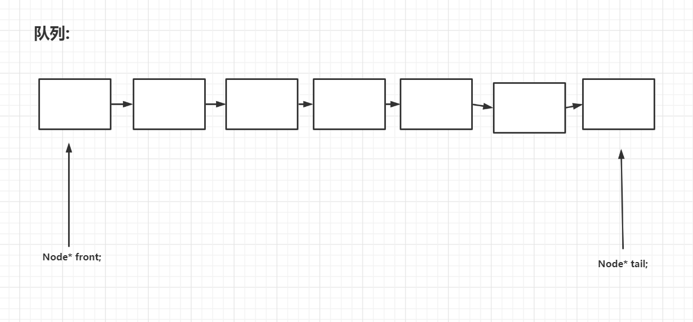

  数据封装成链表表的样子, 并且需要两个结构体

  ```c++
  #include <iostream>
  # include<string>
  
  using QElemType = int;
  using namespace std;
  
  struct Node
  {
  	QElemType data;
  	struct Node* next;
  };
  
  struct LinkQueue
  {
  	Node* front;
  	Node* tail;
  
  	LinkQueue()
  	{
  		front = tail = new Node;
  		tail->next = NULL;
  	}
  
  	int InQueue(int val);
  	int OutQueue();
  	bool Empty();
  	void PrintQueue();
  };
  
  
  int LinkQueue::InQueue(int val)
  {
  	Node* p;
  	p = new Node;
  	if (p)
  	{
  		p->data = val;
  		p->next = NULL;
  		tail->next = p;
  		tail = p;
  	}
  	return 1;
  }
  
  int LinkQueue::OutQueue()
  {
  	Node* p;
  	int i;
  	cout << "\n请输入出队列的个数:";
  	cin >> i;
  	while (i--)
  	{
  		p = front;
  		front = front->next;
  		delete p;
  	}
  	p = NULL;
  	return 1;
  }
  
  bool LinkQueue::Empty()
  {
  	if (front->next == NULL)
  	{
  		cout << "\n队列为空!\n";
  		return true;
  	}
  	return false;
  }
  
  void LinkQueue::PrintQueue()
  {
  	Node* p;
  	p = front->next;
  	cout << "队列:";
  	while (p != NULL)
  	{
  		cout << p->data << " ";
  		p = p->next;
  	}
  }
  
  int main()
  {
  	LinkQueue* queue = new LinkQueue();
  	int q;
  
  	cout << "入队元素(以#结尾): ";
  
  	while (cin >> q)
  	{
  		queue->InQueue(q);
  	}
  	cin.clear();
  	while (cin.get() != '\n')
  		continue;
  
  	queue->PrintQueue();
  	queue->OutQueue();
  	queue->PrintQueue();
  
  	queue->Empty();
  	return 0;
  }
  ```

  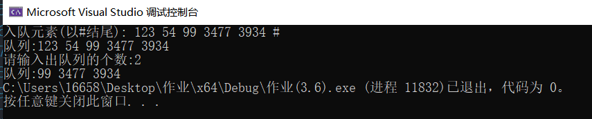

+ ```c++
  // 循环链表
  
  #pragma once
  #include "LinkQueue.h"
  
  LinkQueue::LinkQueue()
  {
  	front = tail = new Node;
  	tail->next = NULL;
  }
  
  int LinkQueue::InQueue(int val)
  {
  	Node* p;
  	p = new Node;
  	if (p)
  	{
  		p->data = val;
  		p->next = NULL;
  		tail->next = p;
  		tail = p;
  	}
  
  	tail->next = front;
  	return 1;
  }
  
  // 先进来的放在链表头
  int LinkQueue::OutQueue()
  {
  	Node* p;
  	int i;
  	cout << "\n请输入出队列的个数:";
  	cin >> i;
  	while (i--)
  	{
  		// 找到直接删掉即可
  		p = front;
  		front = front->next;
  		delete p;
  	}
  	p = front;
  	tail->next = p;
  	return 1;
  }
  
  bool LinkQueue::Empty()
  {
  	if (front->next == NULL)
  	{
  		cout << "\n队列为空!\n";
  		return true;
  	}
  	return false;
  }
  
  void LinkQueue::PrintQueue()
  {
  	Node* p;
  	p = front->next;
  	cout << "队列:";
  	do
  	{
  		cout << p->data << " ";
  		p = p->next;
  	} while (p != front);
  }
  
  ```

  

+ queue容器存放栈容器

  + 使用栈来模式队列的行为，如果仅仅用一个栈，是一定不行的，所以需要两个栈一个输入栈，一个输出
    栈，这里要注意输入栈和输出栈的关系。
  + 在push数据的时候，只要数据放进输入栈就好，但在pop的时候，输出栈如果为空，
    就把进栈数据全部导入进来（注意是全部导入），再从出栈弹出数据，如果输出栈不为空，则直接从出
    栈弹出数据就可以了。
  + 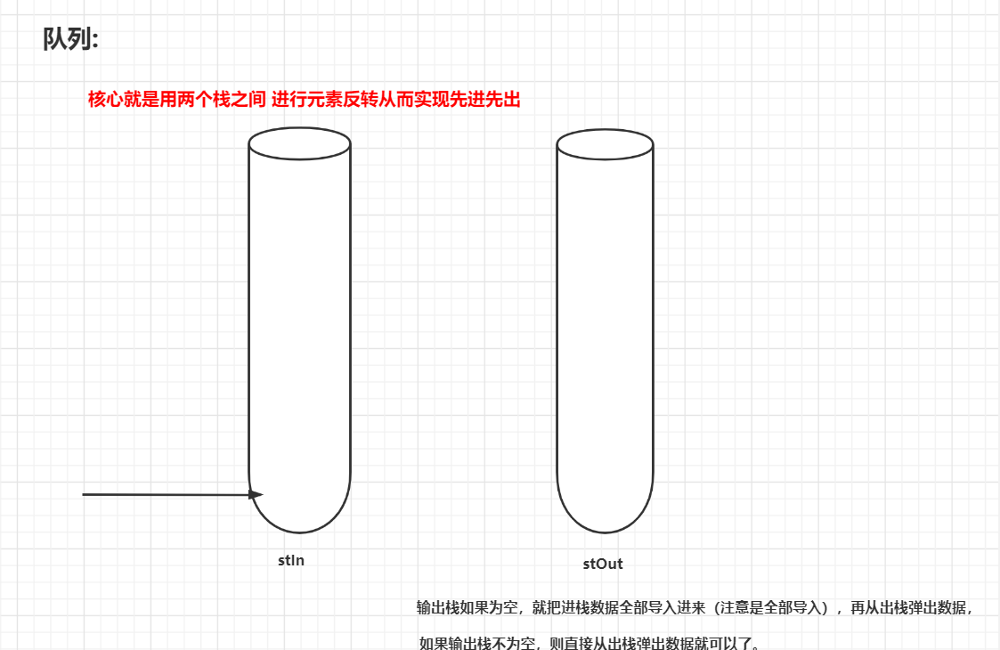

  ```c++
  class MyQueue 
  {
      public:
      stack<int> stIn;
      stack<int> stOut;
      /** Initialize your data structure here. */
      MyQueue() 
      {
      }
  
      void push(int x) 
      {
          stIn.push(x);
      }
      /** Removes the element from in front of queue and returns that element. */
      int pop()
      {
          // 只有当stOut为空的时候，再从stIn里导入数据（导入stIn全部数据）
          if (stOut.empty())
          {
          // 从stIn导入数据直到stIn为空
              while(!stIn.empty())
              {
                  stOut.push(stIn.top());
                  stIn.pop();
              }
          }
          int result = stOut.top();
          stOut.pop();
          return result;
      }
  
      //返回队列开头的元素
      int peek() 
      {
          int res = this->pop(); // 直接使用已有的pop函数
          stOut.push(res); // 因为pop函数弹出了元素res，所以再添加回去
          return res;
      }
      /** Returns whether the queue is empty. */
      bool empty() 
      {
          return stIn.empty() && stOut.empty();
      }
  };
  ```

+ 操作自定义类型

  ```c++
  #include <iostream>
  #include <string>
  #include <queue>
  using namespace std;
  
  
  class MM
  {
  public:
  	MM(string name, int age) : name(name), age(age) {}
  	string getName()
  	{
  		return name;
  	}
  	int getAge()
  	{
  		return age;
  	}
  protected:
  	string name;
  	int age;
  };
  
  
  
  
  int main(void)
  {
  	queue<MM> mm;
  	mm.push(MM("sda", 22));    //面对容器操作自定义类型是都是通过MM("1", 1)的方式创建匿名对象
  	mm.push(MM("s", 12));
  	mm.push(MM("d", 2));
  
  	while (!mm.empty())
  	{
  		cout << mm.front().getName() << mm.front().getAge() << endl;
  		mm.pop();
  	}
  
  	return 0;
  }
  ```

+ 简单实现

  ```c++
  #include <iostream>
  #include <string>
  #include <queue>
  #include <vector>
  
  using namespace std;
  
  class MM
  {
  public:
  	MM(string name, int age) : name(name), age(age) {}
  	string getName()
  	{
  		return name;
  	}
  	int getAge()
  	{
  		return age;
  	}
  protected:
  	string name;
  	int age;
  };
  
  
  template <class T>
  class MyQueue
  {
  public:
  	MyQueue() {}
  	void push(T data)
  	{
  		mem.push_back(data);  // 1 2 3
  	}
  	void pop()
  	{
  		mem.erase(mem.begin());
  	}
  	T front()
  	{
  		return mem[0];
  	}
  	int size()
  	{
  		return mem.size();
  	}
  
  	bool empty()
  	{
  		return mem.size() == 0;
  	}
  private:
  	vector<T> mem;
  };
  
  int main(void)
  {
  	MyQueue<MM> myMM;
  	myMM.push(MM("小可爱", 18));
  	myMM.push(MM("小宝贝", 29));
  	myMM.push(MM("亲爱的", 22));
  
  
  	while (!myMM.empty())
  	{
  		cout << myMM.front().getName() << myMM.front().getAge() << endl;
  		myMM.pop();
  	}
  
  	return 0;
  }
  ```

  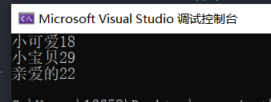


## 3.8  priority_queue

> 大根堆：放进去的时候就已经从大到小排序了，并且大的在前。

优先队列，默认是大根堆：

当然也可以定义成小根堆：

```cpp
priority_queue<int,vector<int>,less<int> > pq
也可以将元素取负
12
```

priority_queue（）常用函数：

- push() 插入一个元素
- top() 返回堆顶元素（可不是front）
- pop() 弹出堆顶元素

一般操作和queue几乎相同 ，下面重点记录一下对结构体的读入和排序。

```cpp
/*
	进一步加深了对结构体的理解，原来node与int,double这种类似，是自己写出来的结构。
*/
#include<iostream>
 using namespace std;
 struct node{
 	int weight;
 	int high;
 }a[10];
 int main(){
 	priority_queue<node> pq;
 	//放入要加{}
 	pq.push({1,2});
 	return 0;
 }
123456789101112131415
```

上面代码会报错。

```cpp
/*
struct less : public binary_function<_Tp, _Tp, bool>
    {
      bool
      operator()(const _Tp& __x, const _Tp& __y) const
      { return __x < __y; }
    };
 */
 /*
 这就是原因，我也不太懂。但是很容易理解因为他优先队列会对结构体排序，他不知道咋排，所以会编译都过不了。
 */
1234567891011
```

But，想要做到还是可以完成的。

```cpp
/*
	按照weight从小到大排序，如果weight一样，按照身高高排序
*/
#include<iostream>
#include<queue>
using namespace std;
struct node{
 	int weight;
 	int high;
 	bool operator <(const node & o)const
 	{
 		if(weight==o.weight)return high<o.high;
 		return weight>o.weight;
	}
 }a;
 int main(){
 	priority_queue<node> pq;
 	pq.push({2,2});
 	pq.push({3,1});
 	pq.push({1,3});
 	cout<<pq.top().high;
 	return 0;
 }
```


## 3.9  string

看 c++ 总结的笔记

内部常用函数:

- size()/length() 返回字符串长度
- empty() 是否为空
- clear() 清空
- substr() 起始下标，(子串长度)) 返回子串
- c_str() 返回字符串所在字符数组的起始地址


## 3.10 pair

#### 3.10.1 pair 容器概念

**基本特性:**

+  对组(pair) 将**一对值组合成一个值**，这一对值可以具有不同的数据类型.
+  两个值可以分别用pair的两个公有函数first和second 访问。

+ 类模板: template <class T1, class T2> struct pair.

  

#### 3.10.1 pair 的初始化

```c++
//第一种方法创建一个对组
pair<string, int> pair1(string("name")，20);
cout << pair1.first << pair1.second << endl: 

//第二种
pair<string， int> pair2 = make Ipair("name"，30);
cout << pair2.first << pair2.second << endl ;

// pair=赋值
pair<string, int> pair3 = pair2;
cout << pair3.first << pair3.second << endl ;
```


自己实现:

```c++
#include <utility>

template <class Type1 ,class Type2> <T>
{
	Type1 first;
	Type2 second;
};

int main()
{
	pair<string, int> object;
	object.first = string("小芳");
    object.second = 18;
	cout<< object.first<<"\t"<< object.second << endl;return 0;
}
```


## 3.11 array

### 3.11.1 基础知识

array表示:  定长数组

**操作基本类型:**

```c++
int main()
{
	array<int, 3> data = { 1,2,3 };
    for (auto v : data)
	{
		cout << v << "\t";
	}
	cout << endl;
	for (int i = 0; i < 3; i++)
    {
		cout << data[i] <<"\t";
	}
	cout <<endl;
    //迭代器的本质就是指针
	array<int, 3>::iterator iter;
	for (iter = data.begin(); iter != data.end(); iter++)
    {
		cout << *iter << "lt";
	}
	cout <<endl;
	return 0;
}
```

**操作自定义类型:**

​	//关键的在于重载  // 必须提供无参构造函数

```c++
#include <iostream>
#include <array>
#include <string>

using namespace std;

// 操作自定义类型的数据关键点在于重载

class student
{
public:
	student() {}
	student(string name, int age) :name(name), age(age) {}
	~student() {}
	friend ostream& operator<<(ostream& out, const student& s)
	{
		out << s.name << "\t" << s.age << endl;
		return out;
	}
private:
	string name;
	int age;
};


int main(void)
{

	//关键的在于重载  // 必须提供无参构造函数
	array<student, 3> stu;
	for (int i = 0; i < 3; i++)
	{
		stu[i] = student("s" + to_string(i), i);

	}
	for (auto v : stu)
	{
		cout << v;
	}
	return 0;
}
```


### 3.11.2 简单实现

```c++
#include <iostream>
#include <string>

using namespace std;

// 简单实现
// size_t : unsigned int
template <class T, size_t size>
class MyArray
{
public:
	// 默认构造
	MyArray()
	{
		memeory = new T[size];   // 动态数组
	}
	// 重载
	T& operator[](int index)
	{
		return memeory[index];
	}

	// 迭代器实现 : 类中类
public:
	T* begin()
	{
		return memeory;
	}

	T* end()
	{
		return memeory + size;
	}

	class iterator
	{
	public:
		iterator(T* p = nullptr) : pMove(p) {}
		// 重载
		//bool operator==(const iterator& rhs) const noexcept
		//{
		//	return pMove == rhs.pMove;
		//}

		iterator& operator=(T* pMove)
		{
			this->pMove = pMove;
			return *this;
		}

		//bool operator!=(const iterator& rhs) const
		//{

		//	return pMove != rhs.pMove;
		//}

		bool operator!=(T* pMove)
		{
			return this->pMove != pMove;
		}

		iterator& operator++(int)
		{
			this->pMove++;
			return *this;
		}

		T operator*()
		{
			return *pMove;  // 返回当前下标下的值
		}

	protected:
		T* pMove;
	};

public:
	// 简单的方法
	T front()
	{
		return memeory[0];
	}
	T back()
	{
		return memeory[size - 1];
	}
	T at(int index)
	{
		return memeory[index];
	}

protected:
	T* memeory;
};


int main(void)
{
	MyArray<int, 3> arr;

	arr[0] = 1;  //  出现表达式是可修改的左值 解决方法: 重载[]时返回引用  T& operator[](int index)
	arr[1] = 2;
	arr[2] = 3;
	for (int i = 0; i < 3; i++)
	{
		cout << arr[i] << endl;
	}
	//MyArray<int, 3>::iterator it;	 // 写对应的重载
	MyArray<int, 3>::iterator it;

	for (it = arr.begin(); it != arr.end(); it++)
	{
		cout << *it << endl;
	}

	return 0;
}
```


###  3.11.3 定长二维数组

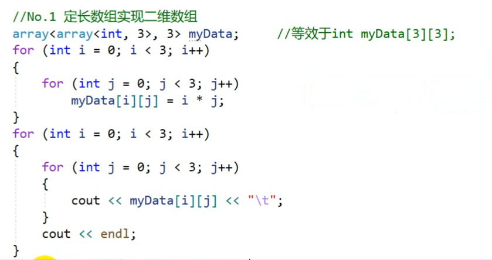


# 四、容器共性和使用场景

## 4.1  STL容器共性机制

1. STL容器所提供的都是值(value)寓意，而非引用(reference)寓意，也就是说当我们给
   容器中插入元素的时候，容器内部实施了拷贝动作,将我们要插入的元素再另行拷贝一份放
   入到容器中，而不是将原数据元素直接放进容器中，也就是说**提供的元素必须能够被拷**
   **贝.(深浅拷贝的问题)**
2. 除了queue和stack之外，每个容器都提供可返回迭代器的函数，运用返回的迭
   代器就可以访问元素。
3. 通常STL不会抛出异常,需要使用者传入正确参数。
4. 每个容器都提供了一个默认的构造函数和默认的拷贝构造函数。
5. 大小相关的构造方法: 1 size)返回容器中元素的个数 2 empty0判断容器是否
   为空

## 4.2 容器的使用时机

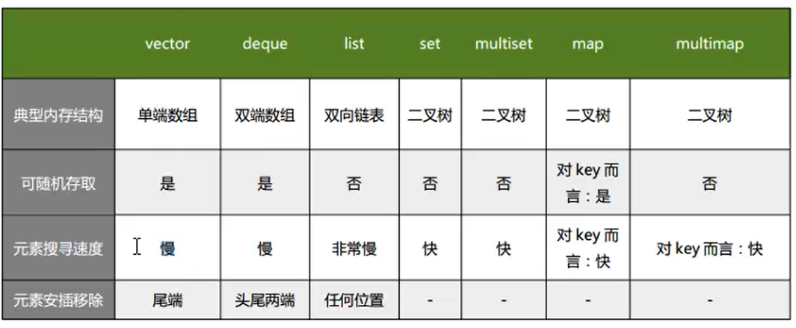

- vector的使用场景︰比如软件历史操作记录的存储，我们经常要查看历史记录，比如上一次的记录，上上次的记录，但却不会去删除记录，因为记录是事实的描述。
  
- deque 的使用场景:比如排队购票系统，对排队者的存储可以采用deque，支持头端的快速移除，尾端的快速添加。如果采用vector，则头端移除时，会移动大量的数据，速度慢.

  vector 与deque的比较︰
  一 :  vector.at() 比 deque.at()效率高，比如vector.at(0)是固定的，deque的开始位置却是不固定的。
  二∶ 如果有大量释放操作的话，vector花的时间更少，这跟二者的内部实现有关。deque支持头部的快速插入与快速移除，这是deque的优点。

  

- list的使用场景︰比如公交车乘客的存储，随时可能有乘客下车，支持频繁的不确实位
  置元素的移除插入。

  

- set的使用场景︰比如对手机游戏的个人得分记录的存储，存储要求从高分到低分的顺
  序排列。

  

- map的使用场景︰比如按ID号存储十万个用户，想要快速要通过ID查找对应的用户。二叉树的查找效率，这时就体现出来了。如果是vector容器，最坏的情况下可能要遍历完整个容器才能找到该用户。
